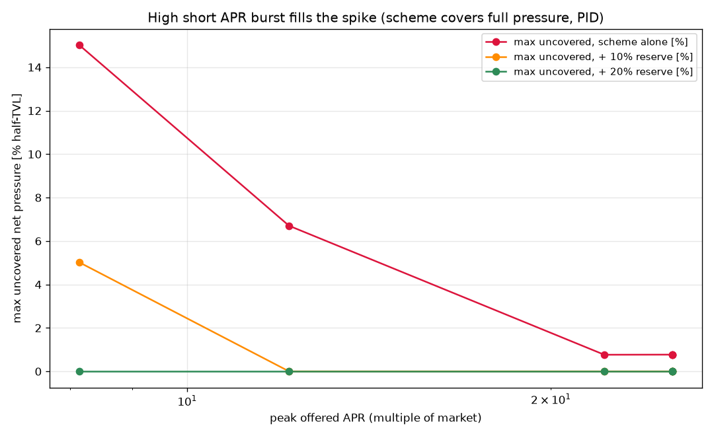

# Dynamic incentives for stabilizing crvUSD and unlocking scaling of Yield Basis
---

## 1. Summary

Yield Basis (YB) runs an AMM with leveraged BTC/crvUSD (or WETH/crvUSD) liquidity whose debt is denominated in **crvUSD**. When the market drops too quickly, the AMM transiently holds more crvUSD debt than the pool's crvUSD balance — a **net pressure** that, left alone, pushes crvUSD off peg. The proposal is to neutralise that pressure with a **dynamic incentive** that briefly pays a bonus APR on a crvUSD venue (scrvUSD, or a crvUSD pool), pulling crvUSD into a supply sink exactly when and as much as needed, and reducing it back when the supply sink is not needed anymore.

**Net pressure** (`(debt - crvusd_in_pool) / yb_pool_size`) is at 0 most of the time (evidenced by a sharp peak in distribution of pressures) with fat tails in the distribution: 99% of the time below 14% of `yb_pool_size = curve_pool_size / 2`, but reaching **+55%** in the 2024-08-05 crash, where it stayed **>20% for ~3 days** and **>40% for ~10 h** (`REPORT_net_pressure.md`). In our definition, positive net pressure is bad (we should try to eliminate it), and negative net pressure is good (handled by crvUSD PegKeepers).

### Headline result

The net pressure can be made nonpositive 99% of the times via dynamically changing incentives given to crvUSD supply sinks (I chose pyUSD/crvUSD pool for this). For that, the pressure should be handled by a [PID controller](https://en.wikipedia.org/wiki/PID_controller). Having some persistent deposits in crvUSD supply sinks (incentivized by YB tokens) at the level of 10-20% of Yield Basis TVL *eliminates the net pressure entirely*. This allows for unbounded scaling of Yield Basis.

#### Key findings which were important in this research:

* Risk premium of scrvUSD is only 1% higher than USDC on Aave, or same as Sky Savings (sUSDS). This means that supply sink is rather inexpensive on average (§2).
* The depositor response is a **dead-band relaxation**: crvUSD only moves once a venue pays ~**2× the market savings rate**, then fills with a ~**5–11 day** time constant and drains a bit faster, according to our measurements (§3–5).
* When fresh large incentives are given - the inflow rate is *very high*. We call it **rush inflow** and model it as well.
* Incentivising a crvUSD pool **cannibalises ~44%** of its new TVL from *other* crvUSD pools, so its net new-liquidity efficiency is **~56%** — but that leakage is **slow**. Fortunately, this does not affect the rush inflow (§6). So combining these two effects leads to having to spend ×1.22 more incentives than without cannibalasing incentives of peer pools.
* A **PID-with-feed-forward** controller covers **~99% of all positive net pressure** — including the worst crash in a 2.4-year backtest — for **~0.15%/yr of Yield Basis TVL**, fully closed with the existing 10-20% YB-token reserve (§7–8).

---

## 2. Market rates and risks

To know how high a bonus APR must go, we first measure the rates depositors compare against and the **risk premia** between crvUSD venues and plain money-market lending (`REPORT_market_rates.md`). Two layers of risk premium matter:

* **Savings-rate premium (mild, ~1%).** Over its full life scrvUSD pays a median
  **+1.0–1.3%** over Aave USDC (on top ~62% of the time) — the premium depositors demand to hold crvUSD over USDC. Against **sUSDS** the spread is **~0** (median +0.03%): Sky already prices ~1% above plain USDC, so scrvUSD ≈ sUSDS ≈ "Aave + 1%" all sit at a comparable level. The premium is *not constant* — it compresses to ~+0.2% in quiet periods.

  

* **Pool LPs** start depositing when the APR is higher than **~2×** of the market rate, and start withdrawing when the APR is below **1×-1.5×** of the market rate. So liquidity provision is more risky and more expensive. Yet, we might prefer it to prevent people from just borrowing crvUSD to farm (purchasing it is what stabilizes the peg).

The market norm used by the controller is **Aave USDC** for the net-pressure backtest (the only series spanning the 2024-08-05 crash), 7-day-EMA-smoothed because it is spiky; the pool-dynamics calibration uses **sUSDS**. All three savings rates agree to ~1%.

---

## 3. Temporal response to incentives

How fast does crvUSD arrive when a venue's APR jumps, and leave when it stops? Measured two independent ways on the PYUSD/crvUSD pool (`REPORT_liquidity_response.md`,
`REPORT_pool_apr_response.md`).

**Raw liquidity, single-exponential per region** `y = a·e^(−t/τ) + b`:

| region | τ (e-folding) | R² |
|--------|--------------:|---:|
| rise (incentive ramp-up) | **11.4 ± 0.6 d** | 0.974 |
| drop (wind-down) | **5.9 ± 0.2 d** | 0.981 |

**Takeaways:** liquidity **arrives ~2× slower than it leaves** (τ_in ~11 d vs τ_out ~6 d). However, there are few other effects to account for in a complete model - see in the next paragraph.

---

## 4. Rush deposits — filling faster than a fixed exponential

A single τ undersells the inflow: when a *small* pool offers a very high APR, deposits
arrive in a **burst** much faster than the base exponential. Fitting one dead-band ODE to
the whole pyUSD TVL series (`REPORT_pool_dynamics.md`) isolates this as a **rush** term —
the inflow rate scales as `(x / x_hi)^p_in` above the band edge:

| quantity | value |
|----------|-------|
| base τ_in | 30 d (rail — inflow near equilibrium is slow) |
| τ_out | 5.9 d |
| **rush exponent p_in** | **1.03** (inflow accelerates ~linearly above the band) |
| R² (log-TVL, one ODE) | 0.974 |

The bottom-row zooms show the two take-offs (Oct-2025, Feb-2026): the pool jumps from
~$1.5M to ~$40M **within a day** as discrete deposit steps. So the effective inflow time
is `τ_in·(x_hi/x)^p_in` — e.g. ~5 d when APR is ~10× the threshold — meaning **"how fast
LPs arrive" is dominated by how attractive the pool is, not a single constant.** This is
what makes a short, high-APR burst able to fill an otherwise-uncatchable spike (§8).

---

## 5. Dead band

LP liquidity is a **dead-band negative-feedback loop**: LPs are inert while the pool APR
sits inside a band around the market rate, and only move when it leaves. Because the LP
APR is **endogenous** (`APR = rewards / TVL`), inflow self-limits — capital arrives until
APR is driven down to the top edge, leaves until it climbs to the bottom edge.

* **Equilibrium band [1.50×, 2.14×] market** (from the unified fit): the LP APR settles
  inside it, and the edges set the absolute TVL level via `L* = rewards / (x·m)`.
* **Asymmetric activation** (from the instantaneous response): inflow switches on sharply
  at **~1.9× ≈ 2×**, but outflow begins as soon as APR dips below **~1×** market — LPs
  tolerate a high rate lazily but won't sit below market. Yield-chasing has more friction
  than yield-fleeing.

This dead band is the source of the **~2× hysteresis** the controller must clear, and the
`L* = rewards/(x·m)` relation is what lets us read "incentive value" straight off as a
target TVL.

---

## 6. Outflows from peer pools — cannibalisation and its structure

A crvUSD pool's incentive can pull liquidity from *other* crvUSD pools rather than create
new crvUSD demand — and rotation between crvUSD pools does nothing for net pressure. We
quantified this against the **aggregate of all 20 all-stablecoin crvUSD/scrvUSD pools**.

**Decomposition** (`REPORT_crvusd_aggregate.md`). Splitting the aggregate into pyUSD vs
others, and the others' incentive into its true LP-reaching components (CRV emissions +
on-gauge YB — the biweekly StakeDAO/Votemarket pYB to peers was a **voter bribe**,
`hook = 0x0`, already reflected in CRV, *not* an LP reward):

**Peer dead-band fit** (`REPORT_others_dynamics.md`). The peers' long decline is mostly
their own fading CRV (TVL ∝ reward pot, `corr = 0.86`) — **plus a real, sustained
competition effect**: while pyUSD is incentivised, the peers' reward is ~flat (−4%/yr) yet
their TVL drains **−35%/yr vs −15%/yr** when it is not, and their APR multiple ticks **up**
(2.00 → 2.16) — capital leaving for a better-paid home.

**Leakage coefficient** (`REPORT_incentive_efficiency.md`). Fitting the single `k` that
reconciles the peers with their own-incentive model, `L_peers + k·L_pyUSD ≈ L_model`:

**k ≈ 44%** (stable 42–45%) → pyUSD's incentive is **~56% efficient** at creating net-new
crvUSD; ~44% is rotation.

**But the leakage is slow — the rush is clean** (`REPORT_rush_migration.md`). On matched
0.6 h sampling, at the rush moments the *aggregate* of all crvUSD pools rises **~1:1 with
pyUSD** (Δaggregate/ΔpyUSD = **0.99 at 1 day**) while peers stay flat (−0.01). The
cross-correlation function `C(τ)` is just **−0.18 at τ = 0**, decaying to ~0 within a day —
no migration lobe (which would be ≈ −1).

**So:** the ~44% cannibalisation lives entirely in the **slow, multi-week channel**; the
**fast rush channel is ~100% new crvUSD.** This is the key structural fact for costing the
controller.

---

## 7. PID controller for incentives

The controller is a **PID-with-feed-forward** in the classic control-loop sense, with the
measured depositor dynamics as the plant (`REPORT_incentive_sim.md`):

* **Reference** = net pressure `P = max(0, net_pressure)`; **plant output** = realised
  sink `S`; **error** `e = P − S`.
* Four parallel paths set the target sink `S*`: feed-forward `α·P`, proportional `Kp·e`,
  integral `Ki·∫e`, and a derivative `Kd·max(0, dP/dt)` on **rising pressure only** (to
  pre-empt a developing spike without derivative kick).
* `S*` is clamped and mapped to an **offered APR multiple** `x = dead_band + S*/β`
  (β = sink attracted per unit excess ratio), hard-capped at `x_max`.
* **Spend = (x − 1)·m·S** — the bonus APR paid **only on the attracted sink**, not the
  whole vault. The plant `1/(τs+1)` is the asymmetric depositor response (τ_in/τ_out + the
  §4 rush).

A derivative term **buys the shoulders, not the spike**: it front-loads the offer at
onset so the sink is already climbing when the multi-day plateau arrives, but no amount of
APR fills a ~2 h instantaneous tip given τ_in — only a pre-built reserve or the high-APR
**burst** can.

---

## 8. Combined simulation results

Driving the controller with the real net-pressure signal of the **worst** BTC candidate
(peak ~48–55%, >20% for ~3 days), re-optimising the PID, and crediting the 20% YB reserve
as evaluation-only insurance.

**With the spiky pressure, a high-APR burst fills the spike cheaply** (the rush of §4):
re-optimising at higher offer caps, max uncovered net pressure collapses while spend
barely moves — with the 20% reserve the worst crash is **fully covered**.

**Folding in the §6 leakage** (`REPORT_incentive_leakage.md`) — derating the slow channel
to 56% while the rush stays 100%:

| leakage model | spend %/yr | ×vs no-leak | coverage | +20% reserve |
|---|---:|---:|---:|---:|
| 100% (no leakage) | 0.119% | ×1.00 | 99.3% | 0.00% uncovered |
| flat 56% (naive ÷0.56) | 0.271% | ×2.28 | 98.2% | 0.00% |
| **rush-clean (slow 56%, rush 100%)** | **0.146%** | **×1.22** | 98.8% | 0.00% |

**The realistic cost of cannibalisation is only ~22%, not ~80%.** Because net pressure is
spiky, coverage rides the **clean rush channel**, so leakage barely bites: spend goes
0.119% → **0.146%/yr** of half-TVL. The flat ÷0.56 derate is not only wrong but
*pessimistic-and-compounding* (×2.28 > 1.79: derating every channel forces both a bigger
pool *and* a higher APR, and spend = APR × TVL). Either way the scheme stays **near-free
insurance**, fully closed with the existing reserve.

---

## 9. The overall model, with measured coefficients

A deployment runs, each step (`dt` in years): read the pool, form
`P = max(0, net_pressure)` with `net_pressure = 2·(debt − b0)/(b0 + b1·p)`; read the
market norm `m` (Aave USDC, 7-day EMA); run the PID on `e = P − S` for a target sink
`S* = clip(α·P + Kp·e + Ki·I + Kd·max(0,dP/dt), 0, S_cap)`; map to an advertised APR
multiple `x = dead_band + S*/β` capped at `x_max`; set **bonus APR = (x − 1)·m** paid only
on the program's deposits `S`. The depositor plant is `dS/dt = (S*−S)/τ` with the rush
acceleration on inflow.

### Measured physics (transferable — these are the science)

| coefficient | value | source |
|---|---|---|
| dead band (equilibrium) | **[1.50×, 2.14×] market** | §5 unified pool fit |
| activation (instantaneous) | inflow ~1.9×, outflow ~1× (asymmetric) | §5 response function |
| τ_out (drain) | **5–6 d** (raw 5.9 d; campaign 4.1 d) | §3 |
| τ_in (base fill) | **8–11 d** effective; ≥30 d near equilibrium | §3–4 |
| rush exponent p_in | **1.03** (inflow ∝ `(x/x_hi)^p_in`) | §4 |
| net-new efficiency | **~56%** (leakage k ≈ 44%, slow channel only) | §6 |
| rush efficiency | **~100% new** (Δagg/Δpy = 0.99 @ 1 d) | §6 |
| crvUSD savings premium | **~1%** over USDC (scrvUSD ≈ sUSDS) | §2 |
| market norm m | Aave USDC, 7-day EMA (≈ sUSDS ≈ scrvUSD) | §2 |

### Controller settings (optimiser outputs — re-tune per deployment)

| symbol | value | role |
|---|---|---|
| dead_band | 2× market | hysteresis floor in `x = 2 + S*/β` |
| x_max | 12–34× market | APR ceiling = worst-case fill speed (12× suffices with 20% reserve) |
| β | 0.5 | deposit elasticity (sink per excess APR-multiple); coverage robust to it, only spend scales |
| α, Kp, Ki, Kd, Imax | ≈ 1.1–1.3, 50, ~1700/yr, ~0.011 yr, ~2.5 | PID gains (P,S in frac half-TVL, time in yr) |
| reserve | 20% (YB-funded) | standing buffer stacked on top |

### Headline economics

* **Spend ~0.15%/yr of half-TVL** for ~99% coverage of all positive net pressure incl.
  the 2024-08-05 crash, fully closed with the 20% reserve — leakage-aware.
* **Scale-free:** all figures are fractions of half-TVL, so they hold from ~$120M to
  billions; the price is a fraction of TVL and co-scales with the YB-earnings budget that
  funds it.

### Open design points (carry into a combined simulator)

* **Buy vs mint.** The mechanism wants incentivised crvUSD to be **bought** on the open
  market (pushes crvUSD toward peg). If depositors **mint** fresh crvUSD instead, it
  raises borrow rate but doesn't relieve the shortfall — steer demand to a buy venue
  (e.g. a crvUSD/pyUSD pool) rather than raw scrvUSD.
* **Stickiness.** Mercenary capital that arrives for a high burst APR also leaves fast
  (τ_out); slowly draining the reserve needs a lock-up/vesting on incentivised deposits.
* **β and high-APR velocity at scale** are the main unmeasured scales: β sets the *price*
  (not feasibility), and deposit velocity above ~2× steps is a *behavioural* unknown
  (crvUSD itself is liquid and instantly buyable).

---

### Underlying detailed reports

`REPORT_net_pressure.md` · `REPORT_market_rates.md` · `REPORT_liquidity_response.md` ·
`REPORT_pool_apr_response.md` · `REPORT_pool_dynamics.md` · `REPORT_crvusd_aggregate.md` ·
`REPORT_others_dynamics.md` · `REPORT_incentive_efficiency.md` · `REPORT_rush_migration.md` ·
`REPORT_incentive_sim.md` · `REPORT_incentive_pyusd.md` · `REPORT_incentive_leakage.md`
