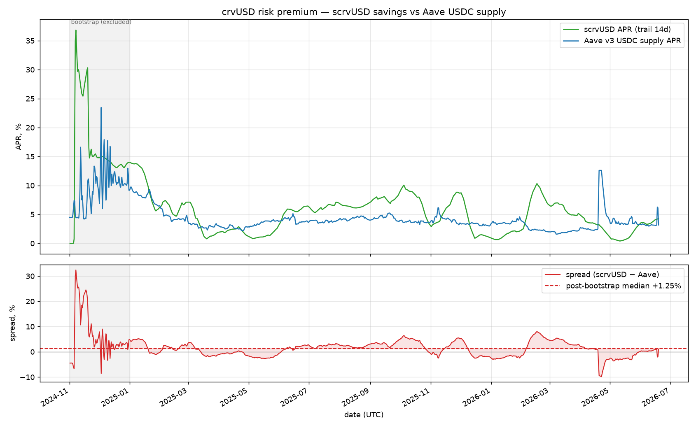
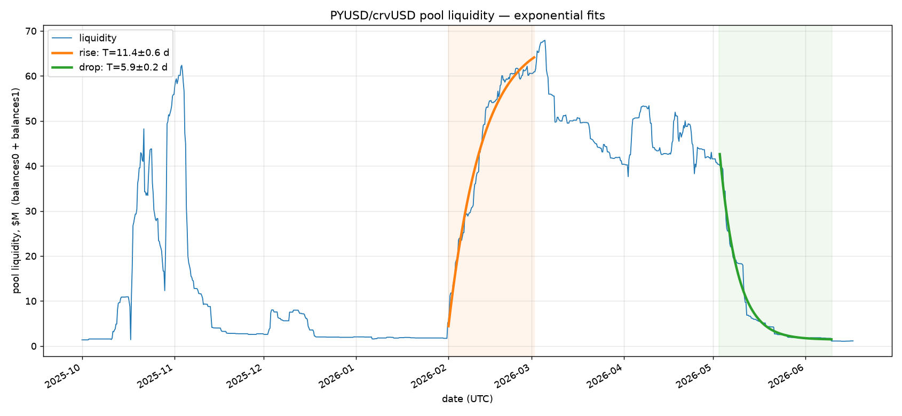
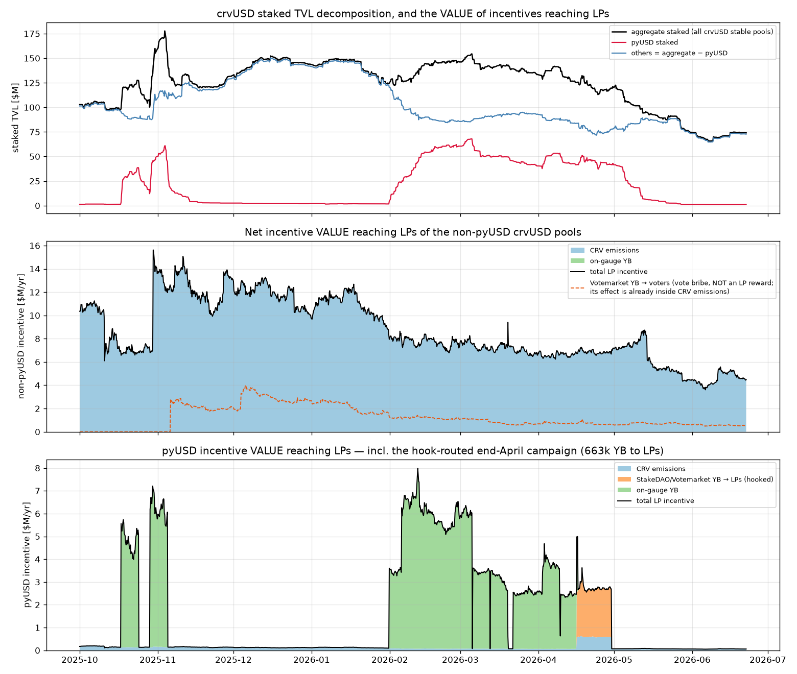
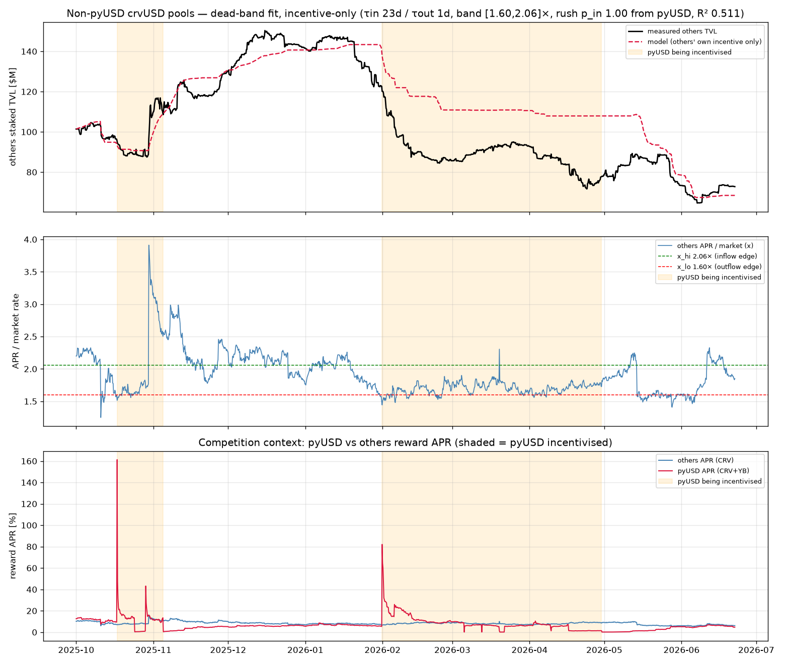
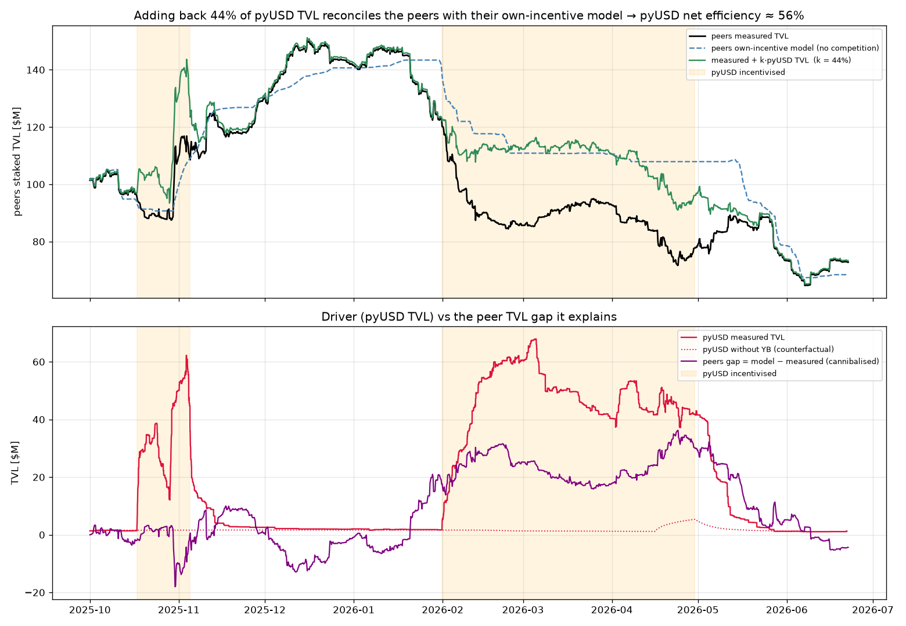
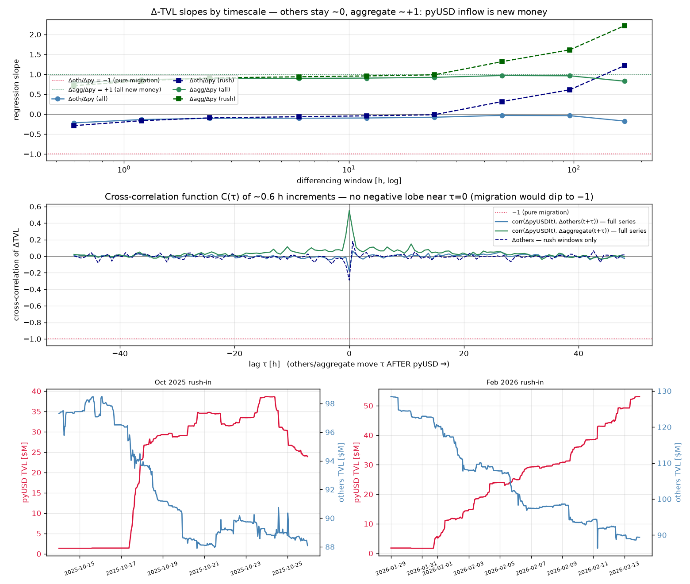

# Dynamic incentives for stabilizing crvUSD and unlocking scaling of Yield Basis
---

## 1. Summary

Yield Basis (YB) runs an AMM with leveraged BTC/crvUSD (or WETH/crvUSD) liquidity whose debt is denominated in **crvUSD**. When the market drops too quickly, the AMM transiently holds more crvUSD debt than the pool's crvUSD balance — a **net pressure** that, left alone, pushes crvUSD off peg. The proposal is to neutralise that pressure with a **dynamic incentive** that briefly pays a bonus APR on a crvUSD venue (scrvUSD, or a crvUSD pool), pulling crvUSD into a supply sink exactly when and as much as needed, and reducing it back when the supply sink is not needed anymore.

**Net pressure** (`(debt - crvusd_in_pool) / yb_pool_size`) is at 0 most of the time (evidenced by a sharp peak in distribution of pressures) with fat tails in the distribution: 99% of the time below 14% of `yb_pool_size = curve_pool_size / 2`, but reaching **+55%** in the 2024-08-05 crash, where it stayed **>20% for ~3 days** and **>40% for ~10 h** (`REPORT_net_pressure.md`). In our definition, positive net pressure is bad (we should try to eliminate it), and negative net pressure is good (handled by crvUSD PegKeepers).


### Headline result

The net pressure can be made nonpositive 99% of the times via dynamically changing incentives given to crvUSD supply sinks (I chose pyUSD/crvUSD pool for this). For that, the pressure should be handled by a [PID controller](https://en.wikipedia.org/wiki/PID_controller). Having some persistent deposits in crvUSD supply sinks (incentivized by YB tokens) at the level of 10-20% of Yield Basis TVL *eliminates the net pressure entirely*. This allows for unbounded scaling of Yield Basis.

#### Key findings which were important in this research:

* Risk premium of scrvUSD is only 1% higher than USDC on Aave, or same as Sky Savings (sUSDS). This means that supply sink is rather inexpensive on average (§2).
* The depositor response is a **dead-band relaxation**: crvUSD only moves once a venue pays ~**1.6× the market rate**, then fills with a ~**week**-scale time constant and drains a bit faster (~6 d), according to our measurements (§3–5).
* When fresh large incentives are given - the inflow rate is *very high*. We call it **rush inflow** and model it as well.
* Incentivising a crvUSD pool **cannibalises ~44%** of its new TVL from *other* crvUSD pools, so its net new-liquidity efficiency is **~56%** — but that leakage is **slow**. Fortunately, this does not affect the rush inflow (§6). So combining these two effects leads to having to spend ×1.15 more incentives than without cannibalasing incentives of peer pools.
* A **PID-with-feed-forward** controller covers **~99% of all positive net pressure** — including the worst crash in a 2.4-year backtest — for **~0.1%/yr of Yield Basis TVL** (≤0.13% worst-case, §8), fully closed with the existing 10-20% YB-token reserve (§7–8).

---

## 2. Market rates and risks

To know how high a bonus APR must go, we first measure the rates depositors compare against and the **risk premia** between crvUSD venues and plain money-market lending (`REPORT_market_rates.md`). Two layers of risk premium matter:

* **Savings-rate premium (mild, ~1%).** Over its full life scrvUSD pays a median
  **+1.0–1.3%** over Aave USDC (on top ~62% of the time) — the premium depositors demand to hold crvUSD over USDC. Against **sUSDS** the spread is **~0** (median +0.03%): Sky already prices ~1% above plain USDC, so scrvUSD ≈ sUSDS ≈ "Aave + 1%" all sit at a comparable level. The premium is *not constant* — it compresses to ~+0.2% in quiet periods.

  

* **Pool LPs** start depositing when the APR is higher than **~1.6×** the market rate, and start withdrawing when it drops below **~1.5×** — i.e. they hold an equilibrium pool APR around **~1.6× market** (the dead band, §5). So liquidity provision is more risky and more expensive than a plain savings deposit. Yet, we might prefer it to prevent people from just borrowing crvUSD to farm (purchasing it is what stabilizes the peg).

The market norm used by the controller is **Aave USDC** for the net-pressure backtest (the only series spanning the 2024-08-05 crash), 7-day-EMA-smoothed because it is spiky; the pool-dynamics calibration uses **sUSDS**. All three savings rates agree to ~1%.

---

## 3. Temporal response to incentives

How fast does crvUSD arrive when a venue's APR jumps, and leave when it stops? Measured two independent ways on the PYUSD/crvUSD pool (`REPORT_liquidity_response.md`,
`REPORT_pool_apr_response.md`).

**Raw liquidity, single-exponential per region** `y = a·e^(−t/τ) + b`:

| region | τ (e-folding) | R² |
|--------|--------------:|---:|
| rise (incentive ramp-up) | **11.4 ± 0.6 d** | 0.974 |
| drop (wind-down) | **5.9 ± 0.2 d** | 0.981 |



**Takeaways:** liquidity **arrives ~2× slower than it leaves** (~11 d rise vs ~6 d drop). This ~11 d is the *effective* fill during a campaign; §4 shows it is a slow base time constant accelerated by a **rush**, so a single τ is not the whole story — see the next paragraph.

---

## 4. Rush deposits and the depositor model

A single τ undersells the inflow: when a *small* pool offers a very high APR, deposits
arrive in a **burst** much faster than a fixed exponential. We fit one **dead-band
relaxation ODE** to the whole pyUSD TVL series (`REPORT_pool_dynamics.md`). The chosen,
**simplified form** — drop the part of pool APR coming from trading fee (~0.26% APR, small)
and make the time constant of rush-in exponent just inversely proportional to the APR (**`p_in = 1`**) —
fits best (**R² 0.976**) and is **analytically solvable**.


**The model.** `L` = staked TVL; the LP APR is **endogenous**, `APR = rewards/L`, so
`x = APR/m` is the APR as a multiple of the market rate `m`. Capital relaxes toward the
dead-band equilibrium, but the inflow rate **accelerates with how far APR sits above the
edge** (the rush, `p_in = 1` ⇒ a `1/x` factor on the time constant):

```
inflow  (x > x_hi):  dL/dt = (L* − L)/τ_eff ,  τ_eff = τ_in·(x_hi/x) ,  L* = rewards/(x_hi·m)
outflow (x < x_lo):  dL/dt = (L* − L)/τ_out ,                           L* = rewards/(x_lo·m)
```

Fitted constants: **τ_in = 57 d** (base; the rush makes the *effective* fill far faster),
**τ_out = 6.0 d**, dead band **[x_lo, x_hi] = [1.52×, 1.60×]** (§5).

**Closed form.** With `u ≡ L/L*` and `x/x_hi = L*/L`, the inflow reduces to the separable
`du/dt = (1−u)·u⁻¹/τ_in`, solved by the principal Lambert-W function `W₀`:

```
t/τ_in = ln((1−u0)/(1−u)) − (u − u0)   ⇔   L(t) = L*·[1 + W₀(−e^{−T})] ,  T = t/τ_in + (1−u0) − ln(1−u0)
```

One curve containing both regimes: **early `L ∝ √t`** (the rush — the bottom-row zooms
show the pool jump ~$1.5M → ~$40M **within a day**) and **late `1−u ∝ e^{−t/τ_in}`** (a
plain exponential settle). The closed form is exact within a constant-reward epoch; the
real, time-varying `rewards(t)`, `m(t)` series is integrated numerically (the fit and the
controller sims).

Equivalently, the inflow speed is **∝ (APR − x_hi·m)** — deposits arrive
proportionally to how far APR sits above the dead-band edge, and self-stop once the inflow
dilutes the (endogenous) APR back down to it. So **"how fast LPs arrive" is dominated by
how attractive the pool is, not a single constant** — which is what lets a short, high-APR
**burst** fill an otherwise-uncatchable spike (§8).

---

## 5. Dead band

The model is a **dead-band negative-feedback loop**: because the LP APR is endogenous
(`APR = rewards/L`), inflow self-limits — capital arrives while `x > x_hi`, driving the APR
down until it reaches the edge; it leaves while `x < x_lo`; in between it holds. The fit
places the band at **[1.52×, 1.60×]** — narrow, i.e. effectively a single **equilibrium pool
APR ~1.6× the market rate** that LPs hold (inflow above it, outflow below). The edges set
the absolute TVL level via `L* = rewards/(x·m)`, which lets us read "incentive value"
straight off as a target TVL.

This **~1.6× equilibrium** is the hysteresis the controller must clear to attract crvUSD.
(The band *width* is only loosely constrained — the edges trade off against τ_in in the
fit — but the ~1.6× level and the overall responsiveness, which are what the controller
needs, are well-determined.)

---

## 6. Outflows from peer pools — cannibalisation and its structure

A crvUSD pool's incentive can pull liquidity from *other* crvUSD pools rather than create
new crvUSD demand — and rotation between crvUSD pools does nothing for net pressure. We
quantified this against the **aggregate of all 20 all-stablecoin crvUSD/scrvUSD pools**.

**Decomposition** (`REPORT_crvusd_aggregate.md`). Splitting the aggregate into pyUSD vs
others, and the others' incentive into its true LP-reaching components (CRV emissions +
on-gauge YB + the part of StakeDAO/Votemarket *voter bribe* which was unused for the bribe
and went as a direct LP incentive instead):



**Peer dead-band fit** (`REPORT_others_dynamics.md`). Fitting the peers with the **same
simplified response model** as §4.



**Leakage coefficient** (`REPORT_incentive_efficiency.md`). Fitting the single `k` that
reconciles the peers with their own-incentive model, `L_peers + k·L_pyUSD ≈ L_model`:



**k ≈ 44%** (stable 42–45%) → pyUSD's incentive is **~56% efficient** at creating net-new
crvUSD; ~44% is rotation.

**But the leakage is slow — the rush is clean** (`REPORT_rush_migration.md`). On matched
0.6 h sampling, at the rush moments the *aggregate* of all crvUSD pools rises **~1:1 with
pyUSD** (Δaggregate/ΔpyUSD = **0.99 at 1 day**) while peers stay flat (−0.01). The
cross-correlation function `C(τ)` is just **−0.18 at τ = 0**, decaying to ~0 within a day —
no migration lobe (which would be ≈ −1).



**So:** the ~44% cannibalisation lives entirely in the **slow, multi-week channel**; the
**fast rush channel is ~100% new crvUSD.** This is the key structural fact for costing the
controller.

---

## 7. PID controller for incentives

The controller is a **PID-with-feed-forward** in the classic control-loop sense, with the
measured depositor dynamics as the plant (`REPORT_incentive_sim.md`):


* **Reference** = net pressure `P = max(0, net_pressure)`; **plant output** = realised
  sink `S`; **error** `e = P − S`.
* Four parallel paths set the target sink `S*`: feed-forward `α·P`, proportional `Kp·e`,
  integral `Ki·∫e`, and a derivative `Kd·max(0, dP/dt)` on **rising pressure only** (to
  pre-empt a developing spike without derivative kick).
* `S*` is clamped to `S_cap` and mapped to an **offered APR multiple** `x = dead_band + S*/β`
  (β = sink attracted per unit excess ratio); the clamp caps the worst-case fill speed.
* **Spend = (x − 1)·m·S** — the bonus APR paid **only on the attracted sink**, not the
  whole vault. The plant `1/(τs+1)` is the asymmetric depositor response (τ_in/τ_out + the
  §4 rush).

A derivative term **buys the shoulders, not the spike**: it front-loads the offer at
onset so the sink is already climbing when the multi-day plateau arrives, but no amount of
APR fills a **sub-hour instantaneous flash** faster than the sink can react (§8) — only a
pre-built reserve absorbs that.

### Controller loop (documentation pseudocode)

A minimal, readable version of the whole loop — read the pool, form the net-pressure
signal, run the PID, and output the bonus APR to set plus the residual still uncovered.
The YB-pool and depositor evolution is assumed (`...`); the constants are the §9 design
point.

```python
# Measured / fitted constants (see §4, §6, §9)
DEAD_BAND  = 1.6        # x_hi: LPs only start arriving above ~1.6x the market rate
BETA       = 0.5        # sink (frac of half-TVL) drawn per unit of offer above the band
S_CAP      = 22.0       # clamp on the target sink (sets the worst-case offered APR in units of market rate)
ALPHA      = 1.16       # feed-forward gain on the pressure
KP, KI, KD = 50.0, 1988.0, 0.0158   # PID gains (P, S in frac of half-TVL; time in YEARS)
I_MAX      = 2.93       # integral clamp
RESERVE    = 0.10       # standing YB-funded buffer absorbing the first 10% (frac half-TVL)
# half-TVL means 50% of Curve pool's TVL, or 100% of YB TVL

I, prev_P, S = 0.0, 0.0, 0.0          # integral accumulator, last pressure, current sink

while True:
    dt = ...                          # control timestep, in YEARS

    # 1. read the YB pool, form the net-pressure signal (the PID reference)
    debt, crvusd, btc, price = read_pool()        # crvusd = b0, btc = b1, price = BTC/USD
    half_tvl     = (crvusd + btc * price) / 2
    net_pressure = (debt - crvusd) / half_tvl     # >0 => crvUSD shortfall in the sink (bad)
    P            = max(0.0, net_pressure)          # only positive pressure is acted on

    # 2. read the program's sink (new crvUSD we parked) and the market rate
    S = program_crvusd_in_sink() / half_tvl        # frac of half-TVL
    m = aave_usdc_apr_ema_7d()                      # market norm, a fraction (e.g. 0.04);
                                                    # time series in aave_rate_smoothed.csv.xz
                                                    # (column `aave_apr_ema7d`)

    # 3. PID on the coverage error  e = P - S   (integral + derivative + proportional)
    e      = P - S
    I      = clip(I + e * dt, 0.0, I_MAX)           # integral term (clamped)
    dPdt   = max(0.0, (P - prev_P) / dt)            # derivative on RISING pressure only
    prev_P = P
    S_target = clip(ALPHA*P + KP*e + KI*I + KD*dPdt,  0.0, S_CAP)

    # 4. map the target sink to an offered APR and set it
    x         = DEAD_BAND + S_target / BETA         # offered scrvUSD APR as a multiple of m
    bonus_apr = (x - 1.0) * m                        # paid ONLY on the program's deposits S
    set_incentive_apr(bonus_apr)                    # the one thing the controller controls

    # 5. report the residual net pressure the reserve must still absorb
    residual = max(0.0, P - S - RESERVE)
    log(net_pressure=net_pressure, offered_x=x, bonus_apr=bonus_apr, residual=residual)

    # 6. the pool + depositors evolve over dt (assumed; NOT part of the controller)
    #    LevAMM trades / rebalances       -> updates debt, crvusd, btc
    #    depositors react to bonus_apr    -> updates S, per the §4 dead-band + rush model:
    #        x > x_hi:  dS/dt = (S* - S) / (tau_in * x_hi/x)    # rush-accelerated inflow
    #        x < x_lo:  dS/dt = (S* - S) /  tau_out              # slower outflow
    ...
```

---

## 8. Combined simulation results

We drive the PID controller (§7) with the **simplified plant** (trading fees of stablecoin
pools not accounted for) on the real net-pressure signal, crediting
the §6 peer-cannibalisation. Everything is in fractions of half-TVL (== YB TVL), so the results are
scale-free. **A high-APR burst fills the spike cheaply** (the §4 rush): the offer spikes
only during a de-peg, so spend stays tiny while coverage rides the fast, clean rush.

### Across all BTC candidates

Optimise the PID **once** on the worst candidate (`mf120_of163`, peak net pressure ~48% on
the 2-hour grid) and apply the **same fixed gains** to every candidate
(`incentive_sim_candidates.py` → `incentive_candidates.csv`). Max residual net pressure
(% of half-TVL):

| candidate | peak P | spend %/yr | coverage | 0% reserve | 10% | 20% |
|---|---:|---:|---:|---:|---:|---:|
| mf120_of135 | 48.2% | 0.109 | 98.6% | 1.20% | **0.00%** | **0.00%** |
| mf120_of163 (opt) | 48.3% | 0.134 | 98.9% | 1.32% | **0.00%** | **0.00%** |
| mf146 / dust3600 | 38.9% | 0.083 | 98.6% | 1.25% | **0.00%** | **0.00%** |
| mf146 / dust600 | 23.5% | 0.081 | 98.5% | 1.39% | **0.00%** | **0.00%** |

On **every** candidate: ~99% coverage, spend **0.08–0.13%/yr** of half-TVL (worst 0.13%,
leakage-aware — ×1.15 over the no-leak 0.117%), and **0% uncovered with a 10% or 20%
reserve**. This confirms the §1 headline: a **10–20% standing reserve eliminates the net
pressure entirely** across all tested scenarios. (`mf137` ships a `.json.xz`, a different
dump the npz pipeline doesn't read, so it is excluded.) The ~1.3% residual at 0% reserve
is a **2-hour-grid figure** that smooths sub-hour flash crashes — see below for the true
instantaneous tip.

### The reserve and the sharp tip — fine resolution

The 2-hour grid above smooths away sub-hour **flash crashes**, so its "~1.3% residual"
understates the true instantaneous tip. Re-optimising the PID on a **15-minute** grid
(`incentive_reserve_fine.py`, full 2.4-year series, ~83k steps — the peak net pressure
resolves to **54.5%** vs the 48% the coarse grid showed) gives the honest worst case:

* coverage **99.7%**, spend **0.095%/yr** — *unchanged* (these are robust to resolution);
* but the **max instantaneous residual is 7.7%** of half-TVL — far above the 2-h figure.

It is **brief and rate-driven**: the binding event is **not** the gradual Aug-2024 grind to
54%, but a **30-minute flash crash on 2024-01-03** — BTC **−5.9% ($44.5k→$41.9k) in 30 min**
slamming net pressure 0→20% faster than the sink can react. **The residual is set by `dP/dt`,
not the peak level.** And it is fleeting — over 2.4 years the residual is above 2% for only
~0.5 h and above 5% for ~0.2 h. What a standing reserve leaves uncovered:

| reserve | max uncovered | time uncovered (2.4 yr) |
|---:|---:|---:|
| 0% | 7.7% | — |
| 1% | 6.7% | 14 h |
| 2% | 5.7% | 0.5 h |
| 3% | 4.7% | 0.2 h |
| 5% | 2.7% | 0.2 h |
| ~8% | 0% | 0 |

So a **2–3% reserve covers everything except a sub-30-minute blip** over the whole backtest;
**full** coverage of the sharpest flash needs **~8%** of half-TVL. This **vindicates the
10–20% headline reserve** as conservative-safe (and corrects the coarse-grid intuition that
~1.4% suffices). The real design knob is **how brief a peg deviation is tolerable** vs the
reserve size — *not* the spend, which stays ~0.1%/yr regardless. **Caveat:** the tip is
itself resolution-limited — finer than 15 min would reveal a still-higher, still-briefer
spike approaching the instantaneous flash magnitude.

---

## 9. The overall model, with measured coefficients

A deployment runs, each step (`dt` in years): read the pool, form
`P = max(0, net_pressure)` with `net_pressure = 2·(debt − b0)/(b0 + b1·p)`; read the
market norm `m` (Aave USDC, 7-day EMA — provided as a time series in
`aave_rate_smoothed.csv.xz`, column `aave_apr_ema7d`); run the PID on `e = P − S` for a target sink
`S* = clip(α·P + Kp·e + Ki·I + Kd·max(0,dP/dt), 0, S_cap)`; map to an advertised APR
multiple `x = dead_band + S*/β` (with `S*` clamped at `S_cap`); set **bonus APR = (x − 1)·m** paid only
on the program's deposits `S`. The depositor plant is `dS/dt = (S*−S)/τ` with the rush
acceleration on inflow.

### Measured physics (transferable — these are the science)

| coefficient | value | source |
|---|---|---|
| dead band / equilibrium APR | **~1.6× market** (fit band [1.52×, 1.60×]) | §4/§5 |
| τ_out (drain) | **6.0 d** (raw 5.9 d) | §3–4 |
| τ_in (base fill) | **57 d** base; rush makes the *effective* fill ~week-scale | §3–4 |
| rush | **`p_in = 1`** ⇒ inflow ∝ `(APR − x_hi·m)` (Lambert-W closed form) | §4 |
| net-new efficiency | **~56%** (leakage k ≈ 44%, slow channel only) | §6 |
| rush efficiency | **~100% new** (Δagg/Δpy = 0.99 @ 1 d) | §6 |
| crvUSD savings premium | **~1%** over USDC (scrvUSD ≈ sUSDS) | §2 |
| market norm m | Aave USDC, 7-day EMA (≈ sUSDS ≈ scrvUSD) — time series in **`aave_rate_smoothed.csv.xz`** (col `aave_apr_ema7d`, raw in `aave_usdc_apr`; built by `smooth_aave.py`) | §2 |

### The parameters actually used (the found design point)

The cross-candidate sims (§8) use the **simplified analytical plant** — the `fee = 0`,
`p_in = 1` Lambert-W model above — taken end-to-end with *its own* fitted parameters
(`fit_pool_dynamics_simple.py`), the rush-clean leakage, and a PID optimised on
`mf120_of163`:

| symbol | value | role |
|---|---|---|
| plant | `p_in = 1`, `fee = 0` (analytical / Lambert-W, §4) | depositor response |
| dead band | `x_lo = 1.52×`, `x_hi = 1.60×` market (~1.6× equilibrium) | §4/§5 |
| τ_in / τ_out | 57 d / 6.0 d | base fill / drain (rush dominates fill) |
| β | 0.5 | deposit elasticity (sink per excess APR-multiple); coverage robust, only spend scales |
| S_cap | 22 (target-sink clamp) | caps worst-case fill speed ⇒ offer ≲46×; realized peak ~34× |
| efficiency | slow channel **56%**, rush **100%** (rush-clean) | peer cannibalisation, §6 |
| **PID gains** | **α = 1.16, Kp = 50, Ki = 1988 /yr, Kd = 0.0158 yr, Imax = 2.93** | optimised on `mf120_of163` (P,S in frac half-TVL, t in yr) |
| reserve | 10–20% (YB-funded) | standing buffer stacked on top — covers even the sharp tip (§8) |

Gains are optimiser outputs (re-tune per deployment); the plant constants are the §4 fit.

### Headline economics

* **Spend ~0.08–0.13%/yr of half-TVL** (worst candidate 0.13%, leakage-aware) for ~99%
  coverage of all positive net pressure incl. the 2024-08-05 crash — **fully closed (0%
  uncovered) with a ≥10% reserve on every BTC candidate** (§8 spreadsheet).
* **Scale-free:** all figures are fractions of half-TVL, so they hold from ~$120M to
  billions; the price is a fraction of TVL and co-scales with the YB-earnings budget that
  funds it.

---

### Underlying detailed reports

`REPORT_net_pressure.md` · `REPORT_market_rates.md` · `REPORT_liquidity_response.md` ·
`REPORT_pool_apr_response.md` · `REPORT_pool_dynamics.md` (incl. the simplified fee=0/p_in=1
fit) · `REPORT_crvusd_aggregate.md` · `REPORT_others_dynamics.md` ·
`REPORT_incentive_efficiency.md` · `REPORT_rush_migration.md` · `REPORT_incentive_sim.md`
(control structure). Sims: `incentive_sim_candidates.py`, `incentive_reserve_fine.py`.
