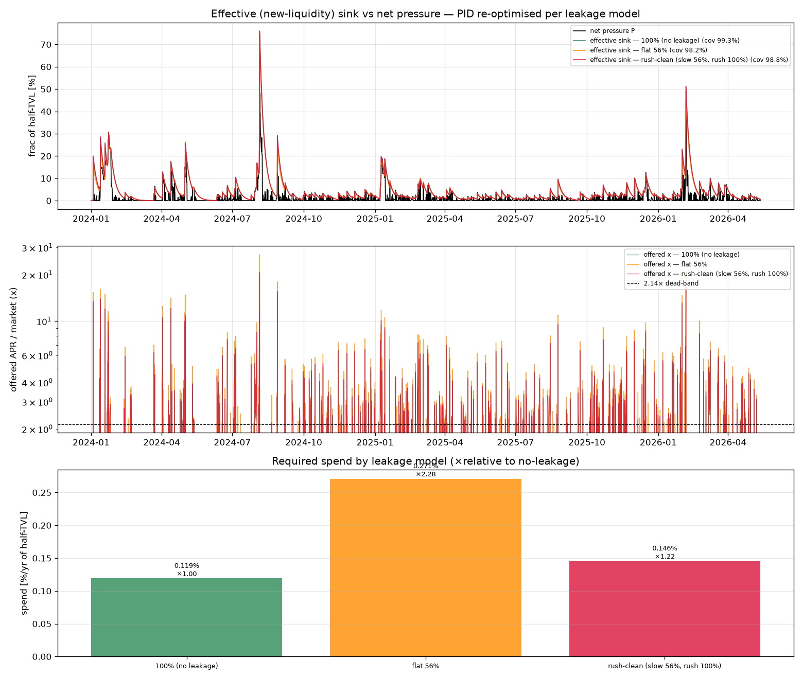

# Supply-sink cost after peer cannibalisation — the rush keeps it cheap

`REPORT_incentive_efficiency.md` found only **~56%** of the TVL an incentive parks in
pyUSD is *new* crvUSD; the other ~44% rotates in from other crvUSD pools and does
nothing for net pressure. The naive correction is "spend ÷ 0.56" — roughly double. But
that ignores the *structure* of the leakage: it is a **slow, sustained** migration,
whereas the **rush** inflow is genuinely new liquidity (no rush-time anti-correlation,
`REPORT_crvusd_aggregate.md`). `incentive_sim_leakage.py` derates the two inflow
channels of the pyUSD-calibrated supply-sink model (`incentive_sim_pyusd.py`)
separately and re-optimises the PID under each assumption.

* **base / slow channel** — the `(x/HYST)^p_in = 1` floor present even at the band edge:
  cannibalising, only 56% new.
* **rush channel** — the excess `(x/HYST)^p_in − 1` a high offer adds: 100% new.

The controller must drive the **effective** (new-liquidity) sink to cover pressure, but
spend is paid on the **whole** pool (you can't tell rotated from new crvUSD).

## Result (worst BTC candidate, full pressure, β = 0.5, 20% YB reserve)

| leakage model | spend %/yr | ×vs no-leak | coverage | peak deficit | +20% reserve |
|---|---:|---:|---:|---:|---:|
| **100% (no leakage)** | 0.119% | ×1.00 | 99.3% | 0.49% | **0.00%** |
| **flat 56%** (naive ÷0.56) | 0.271% | ×2.28 | 98.2% | 1.11% | **0.00%** |
| **rush-clean** (slow 56%, rush 100%) | **0.146%** | **×1.22** | 98.8% | 0.70% | **0.00%** |



**The realistic penalty is only ~22%, not ~80–130%.** Because BTC net pressure is
**spiky** (mean 1.4%, peak 48% of half-TVL), coverage is dominated by the crash spikes —
and a spike makes the PID offer a high APR, which fires the **clean rush channel**. New
liquidity rushes in exactly when it's needed, so the cannibalisation derate barely
touches the cost: **0.119% → 0.146%/yr** of half-TVL.

**The flat derate is not only wrong, it is pessimistic in a compounding way (×2.28 >
1/0.56 = ×1.79).** If *every* channel is derated, the controller must both build a
bigger pool *and* push a higher APR through the dead band to do it (mean offer 3.84×
vs 3.52×, peak 27× vs 20×), and spend = APR × TVL, so both factors inflate. So "just
divide by 0.56" actually *under*-states the cost of the pessimistic case.

So the honest, structure-aware answer is between the two but close to the cheap end:
the supply sink still works, at **~0.15%/yr** rather than the 0.12% it would cost with
no leakage — a modest ~22% premium, fully covered with the 20% YB reserve.

## Caveats

* This credits the rush as 100% new, per the aggregate finding. If some of even the
  rush were rotation, the true cost sits between rush-clean (×1.22) and flat (×2.28).
* The 56% slow-channel efficiency is the measured pyUSD aggregate (`k ≈ 44%`), with the
  uncertainty noted in `REPORT_incentive_efficiency.md` (the peers' dead-band model is
  noisy, biasing `k` somewhat high — i.e. real leakage may be *less*, making the sink
  even cheaper).
* β (deposit depth) is still the main unmeasured scale; it moves spend in all three
  scenarios together and does not change the ratios.

## Run

```sh
uv run python incentive_sim_leakage.py --beta 0.5 --scap 40 --buffer 0 \
    --eval-reserve 0.20 --save pics/incentive_leakage.png
```
