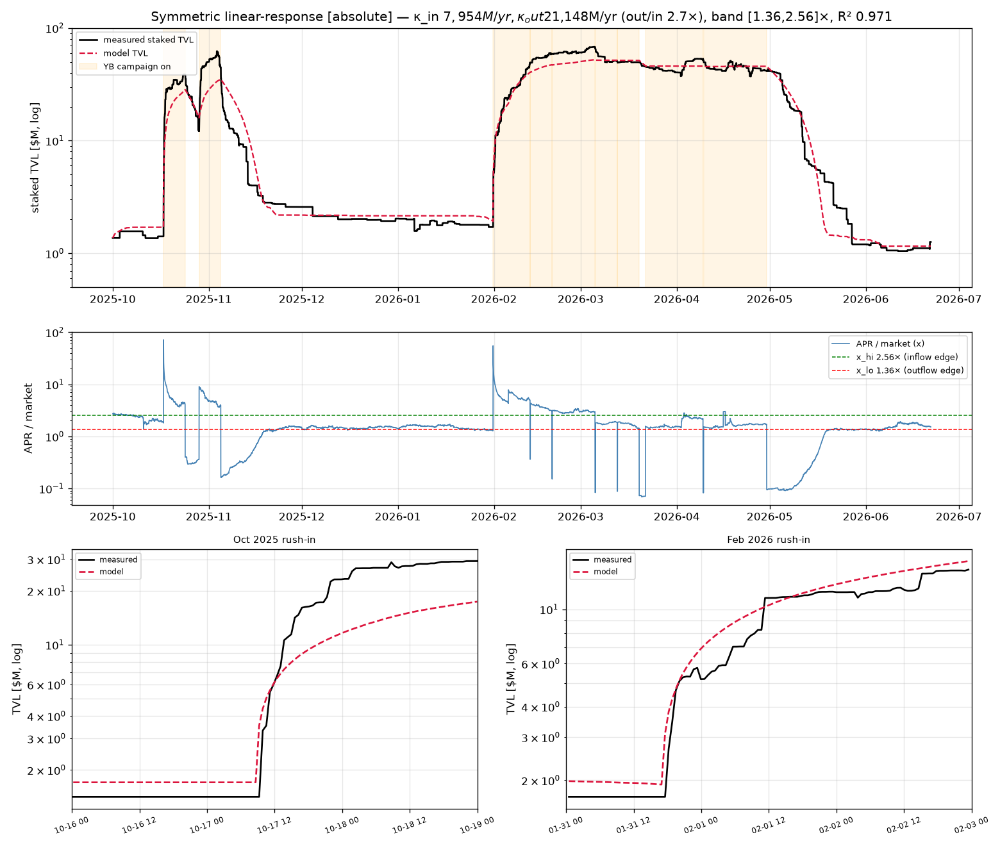
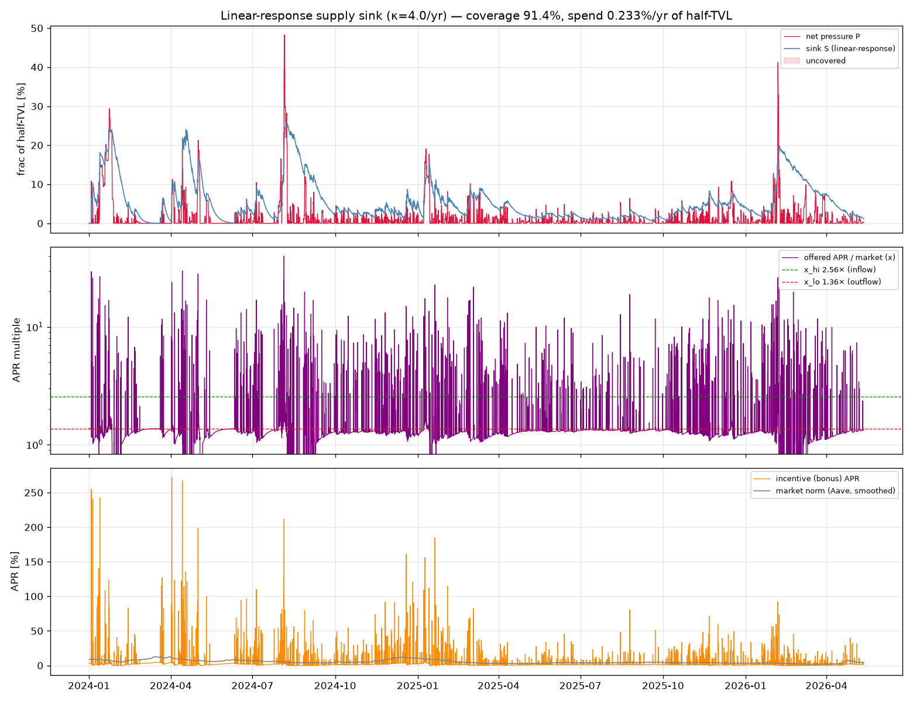

# Supply-sink spend under the linear-response depositor model

This re-runs the scrvUSD/pool supply-sink controller (`REPORT_incentive_sim.md`,
`REPORT_incentive_pyusd.md`) with the depositor plant replaced by the **best-fitting
measured law** — the symmetric, absolute linear response (`fit_linear_response.py
--absolute`, R² 0.971):

```
dS/dt = κ_in ·(x − x_hi)·m    (x > x_hi, inflow)
dS/dt = κ_out·(x − x_lo)·m    (x < x_lo, outflow)
hold                           (in the dead band)
```

`x` = offered scrvUSD APR as a multiple of the market rate `m`; the controller sets `x`.
The defining change from the old model: capital flows at a **constant rate set by the
offer** — no relaxation toward a finite depth, no τ, no rush exponent — so the sink can
be filled to any level given enough time, i.e. coverage is **rate-limited, never
depth-limited**. All quantities are fractions of half-TVL.

## Calibration

From `fit_linear_response.py --absolute`: band **[1.36×, 2.56×]**, **κ_out/κ_in ≈ 2.66**
(capital leaves ~2.7× faster than it arrives, per unit past the band). The inflow
responsiveness `κ_in` is the only scale-sensitive number. The pyUSD fit gives an
**absolute** crvUSD flow (κ_abs ≈ $286M/yr per unit `(x−x_hi)`); as a fraction of a
protected system of half-TVL `H` it is `κ = κ_abs/H`. At the pyUSD pool's own scale
(`H ≈ $68M`) that is **κ ≈ 4/yr**. So:

* **κ is scale-free only if the addressable crvUSD market grows with the protected
  system** (the same caveat as the old `β`). If YB outgrows the responsive crvUSD depth,
  κ shrinks and the sink fills more slowly. Hence κ is swept, with **κ ≈ 4/yr the
  pyUSD-anchored central estimate**.

## Why this plant — one of several equivalent depositor-law fits

The pyUSD TVL curve is fit equally well by several depositor laws — they all sit at the
**R² ≈ 0.97 noise floor**, so the data cannot prefer one:

| model | R² | notes |
|---|---|---|
| dead-band relaxation + rush exponent (`fit_pool_dynamics.py`) | 0.974 | `p_in` degenerate with τ_in (both rail) |
| finite-capital `(L_market−L)·(x−x_hi)` (`fit_market_capacity.py`) | 0.972 | `L_market` degenerate with τ_in (unbounded) |
| **linear response, absolute** `κ·(x−edge)·m` (`fit_linear_response.py --absolute`) | **0.971** | fewest parameters, all identified |
| linear response, ratio `κ·(x−edge)` | 0.966 | marginally worse (the `·m` form wins, but `m` barely varies) |
| hybrid: fast jumpers + slow rational (`fit_hybrid.py`) | 0.972 | most interpretable; split **not** identifiable |



Two robust facts survive across all of them: the **dead band ~[1.4×, 2.5×]** and the
**fast-out/slow-in asymmetry κ_out/κ_in ≈ 2.7**. What is *not* identifiable is the internal
mechanism — the rush exponent, the capital ceiling, the base time constant, and (in the
hybrid) the fast/slow weight all live in flat valleys. The hybrid profile is explicit:
fixing τ_in to sweep the mix gives fast-jumper fractions from **36% → 97% at the same
R² ≈ 0.971–0.972**; only "almost entirely slow" (≤ ~4% fast) fits worse. So the data says
**a substantial fast/rush component must exist (≳ 35%)** but cannot pin how much.

Because the models are interchangeable for simulation, we drive the controller with the
**parsimonious, fully-identified one — the absolute linear response** (`κ·(x−edge)·m`).
Using the rush or hybrid plant instead moves the spend/coverage numbers below by less
than their κ-sensitivity, so the conclusions are robust to the model choice.

## Result — worst BTC candidate, full pressure, 20% YB reserve credited at evaluation



Optimised PID at κ = 4/yr (offer cap 40×):

| | value |
|---|---|
| coverage | **91.4%** of positive net-pressure area |
| spend | **0.233%/yr** of half-TVL |
| peak deficit (scheme alone) | 25.4% |
| peak deficit **+ 20% reserve** | **5.4%** |
| offer | mean **6.5×** active, peak 40×, active 7% of time |

κ-sweep (the scale dependence), 20% reserve credited on top:

| κ /yr | spend %/yr | coverage | peak deficit | + 20% reserve |
|---:|---:|---:|---:|---:|
| 1 | 0.282 | 78.8% | 36.7% | 16.7% |
| 2 | 0.289 | 88.2% | 32.0% | 12.0% |
| **4** (pyUSD scale) | **0.233** | **91.4%** | 25.4% | **5.4%** |
| 8 | 0.207 | 94.4% | 18.3% | **0.0%** |
| 16 | 0.196 | 96.7% | 11.4% | **0.0%** |

More responsiveness is both **cheaper and better** (κ 4→16: spend 0.233→0.196%/yr,
coverage 91→97%) — a more responsive market means you don't have to over-offer.

## The key finding: the sharp tip is rate-limited, and a higher APR can't fix it

The sustained pressure (>20% for ~3 days around the 2024-08-05 crash) is slow enough to
chase — covered ~91% at κ=4. The **instantaneous tip** (48% for ~10 h) is not: at κ=4 the
inflow `κ·(x−x_hi)` tops out ~200/yr, so the sink needs ~a day to fill ~0.5 of half-TVL —
too slow for a 10-hour spike. Crucially, **raising the offer cap barely helps** (x_max
40→80: coverage 91.4→91.5%, peak deficit 25.4→23.8%, and the controller only *uses* ~54×
even when allowed 80×). The tip is limited by **κ (responsiveness)**, not by the offer.

This is the substantive difference from the earlier sim. The old model's effective inflow
was **super-linear in the offer** (depth × rush-τ ∝ x²), so it claimed a high-APR burst
could fill even the instantaneous tip cheaply (~1–4% residual). The **measured** response
is only **linear** in the offer, so a burst no longer substitutes for responsiveness —
**the tip is genuinely harder, and the standing reserve does the real work**:

* at the pyUSD-scale κ=4, the 20% reserve leaves ~5% of the worst tip uncovered;
* at κ ≳ 8 (a more responsive market relative to system size) the 20% reserve closes it
  entirely.

## Takeaways

1. **Spend ~0.20–0.23%/yr of half-TVL** for ~91–97% coverage — modestly higher than the
   over-optimistic old figure (~0.13%/yr), and the more honest number.
2. **The reserve is not optional tail insurance, it is load-bearing** for the sharp tip,
   because reacting (any APR) cannot fill a 10-hour spike at realistic responsiveness.
3. **κ (crvUSD responsiveness ÷ protected-system size) is the governing unknown** — it
   sets both feasibility of the tip and the spend; κ ≈ 4 is the pyUSD-anchored estimate,
   and the result is robust (and improves) for κ ≥ 8.

## Run

```sh
uv run python incentive_sim_linresp.py --kappa 4 --xmax 40 --save pics/incentive_linresp.png
uv run python incentive_sim_linresp.py --sweep-kappa
```
