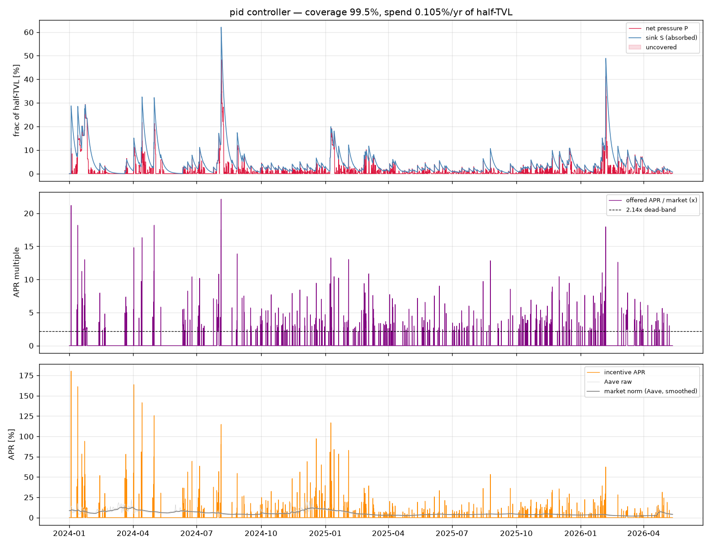

# Supply-sink incentives, recalibrated from the pyUSD fit (the rush helps)

`incentive_sim_pyusd.py` is the `incentive_sim.py` testbed (see
`REPORT_incentive_sim.md`) with the depositor-response model replaced by the one
**measured** in the unified pyUSD/crvUSD TVL fit (`REPORT_pool_dynamics.md`), rather
than the earlier hand-picked anchors:

| element | old (`incentive_sim.py`) | new (pyUSD-calibrated) |
|---------|--------------------------|------------------------|
| dead-band inflow edge | 2.0× (guess) | **2.14×** (fit) |
| τ_out (outflow) | 4.5 d | **5.9 d** |
| τ_in (base inflow) | 9 d | **30 d** (rush-dominated) |
| **inflow rush** | none | **`(x/2.14)^p_in`, p_in = 1.03** |

The headline is the **rush**: the pyUSD fit found inflow accelerates ~linearly with
how far APR sits above the dead-band (`p_in ≈ 1.03`). That is *measured evidence* for
the burst idea — offer a very high APR briefly and the sink fills `~x/2.14×` faster
than a fixed-τ model. So the sharp net-pressure spikes the old model couldn't catch
become catchable.

## Burst sweep — the rush lowers both the required APR and the residual

Re-optimising the PID at each offer cap (worst BTC candidate, full pressure, β = 0.5),
max uncovered net pressure (% of half-TVL) at three reserve levels:


| peak offered APR | spend %/yr | 0% reserve | + 10% reserve | + 20% reserve |
|-----------------:|-----------:|-----------:|--------------:|--------------:|
| 8.1×  | 0.117% | 15.0% | 5.0% | **0.0%** |
| 12.1× | 0.107% | 6.7%  | **0.0%** | 0.0% |
| 22.1× | 0.105% | **0.77%** | 0.0% | 0.0% |
| 25.2× | 0.107% | 0.77% (saturates) | 0.0% | 0.0% |

Compared with the old (no-rush) model:

* **Lower residual.** Scheme-alone floor **3.8% → 0.77%** — the rush fills fast enough
  to nearly catch even the instantaneous tip.
* **Lower required APR.** The floor is reached at **~22–25×** instead of 34×, and the
  optimiser *stops* pushing APR past ~25× (the rush makes more APR not worth the spend).
* **With the 20% YB reserve, the worst crash is fully covered at just ~8×** (the old
  model needed ~12×). Spend stays ~0.10–0.12%/yr of half-TVL.

So the burst strategy isn't a hopeful extrapolation any more — the rush that powers it
is the same effect we fit on real pyUSD TVL data.

## PID design point

Optimised PID at a 22× cap (full pressure, β = 0.5):

| | value |
|---|---|
| coverage | 99.5% |
| peak deficit (scheme alone) | **0.77%** of half-TVL |
| with 20% reserve | **0.0% uncovered** |
| spend | **0.105%/yr** of half-TVL |
| offer | mean **3.8×** active, peak **22×**, active **7%** of time |
| gains | α = 1.06, Kp = 50, Ki = 1992 /yr, Kd = 0.0103 yr, Imax = 2.29 |



## Caveats

* **The rush is real new liquidity, not pool-rotation** — validated against the
  aggregate of all crvUSD stable pools (`REPORT_crvusd_aggregate.md`): during pyUSD
  rush-ins other crvUSD pools do *not* drain (rush-time corr +0.06), and aggregate
  TVL rises with the incentive. So relying on the rush is justified.
* The pyUSD depositors are a *different* base than scrvUSD's, but they're the best
  on-chain calibration of "how DeFi LPs chase incentive APR," and the dead-band /
  rush shape should transfer better than the earlier guesses.
* `β` (deposit depth) is still the main unmeasured scale — see `REPORT_incentive_sim.md`;
  spend scales with it, coverage does not.

## Run

```sh
uv run python incentive_sim_pyusd.py --controller pid --sweep-scap --dt-hours 2 \
    --beta 0.5 --buffer 0 --save pics/incentive_pyusd_scap.png
uv run python incentive_sim_pyusd.py --controller pid --optimize --scap 10 \
    --buffer 0 --eval-reserve 0.20 --save pics/incentive_pyusd_pid.png
```
