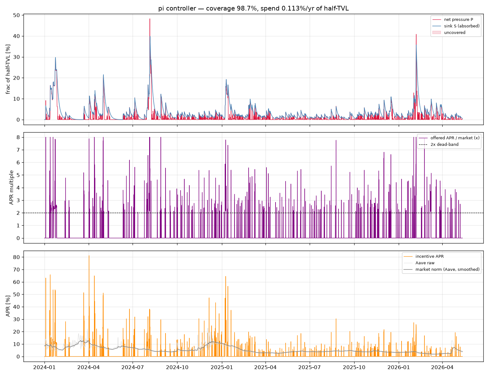
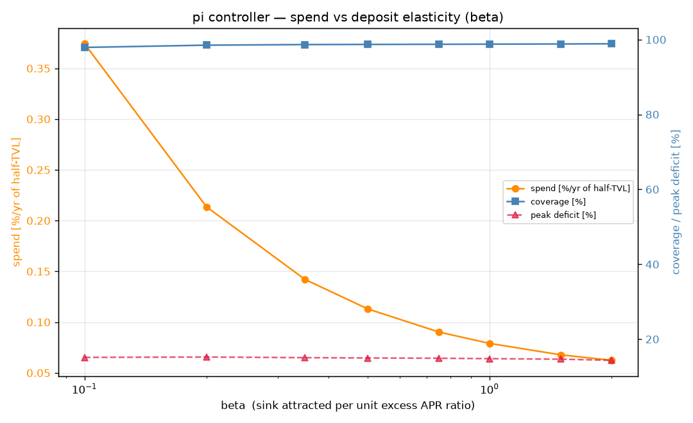
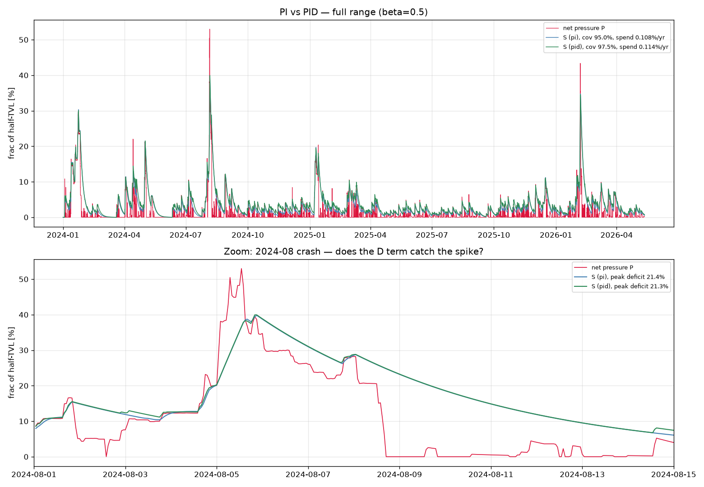
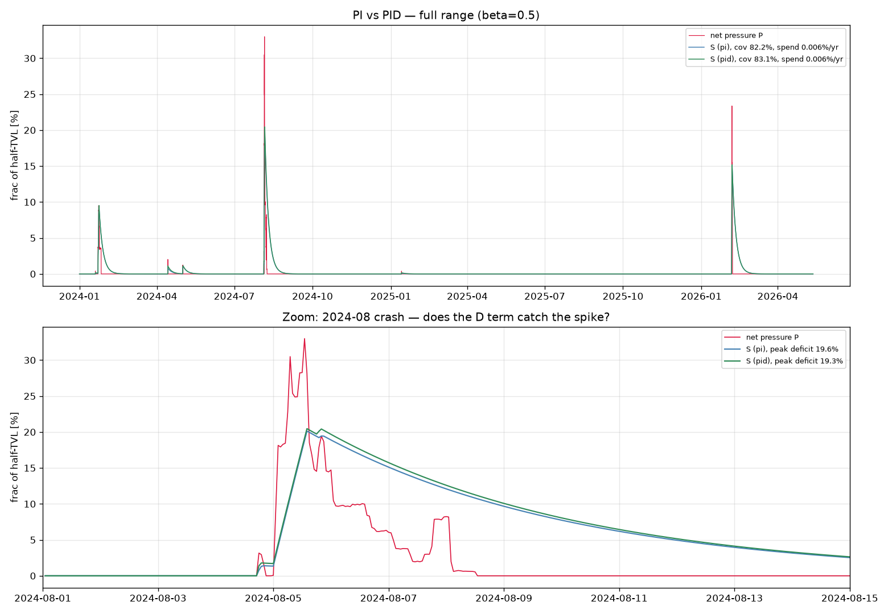
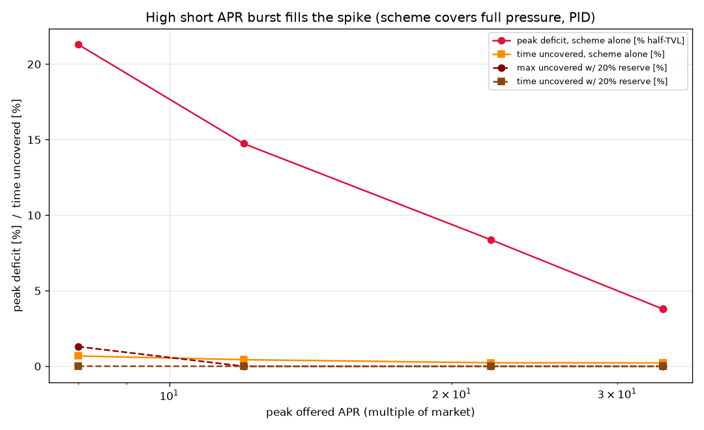
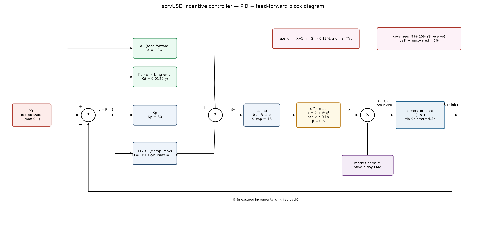

# Supply-sink incentive model — covering net pressure with scrvUSD

When LevAMM runs a positive **net pressure** (a crvUSD shortfall in the supply
sink — see `REPORT_net_pressure.md`), the idea is to pay a temporary bonus APR on
scrvUSD. That raises its APR, crvUSD depositors arrive (slowly), and the
incremental sink absorbs the shortfall. We want to **cover the positive pressure
while spending as little as possible** — and not much more than needed.

`incentive_sim.py` is a testbed: it drives a depositor-dynamics model with the
net-pressure signal, lets a controller set the incentive, and an optimiser tunes
the controller to minimise spend at a target coverage.

All quantities are in **normalised units** — `P` (pressure) and `S` (sink) are
fractions of half-TVL, i.e. the same units as `net_pressure`, so results are
scale-free (multiply by half-TVL for dollars).

## Scaling — why pool-fraction units

The target here is growth from today's ~**$120M** in pools (where net pressure is
observed) toward **billions**, so everything is deliberately expressed as a
**fraction of the pool's half-TVL** rather than against external absolute TVLs.
Consequences:

* **Every headline number is scale-free.** The ~0.13%/yr spend, the 2.7%/0%
  uncovered figures, and the 34× APR ceiling hold identically at $120M or $10B.
  Funding is self-consistent too: spend is a fraction of TVL, and so is the
  YB-earnings (negative-APR) budget that pays for it — they co-scale.
* **β is scale-invariant *iff* crvUSD supply co-scales with the pools.** β = 0.5
  (= 1/dead_band, giving the tidy `x = dead_band·(1 + S*)`) implicitly assumes the
  responding crvUSD/scrvUSD depth is ~1 half-TVL per unit excess. That holds at
  small scale (the responding market dwarfs a small pool) and is plausible at scale
  *because these pools are themselves a primary crvUSD sink* — but if pool growth
  outruns crvUSD liquidity, β (pool-normalised) **shrinks** and the incentive gets
  pricier. So at billions, read β = 0.5 as a **central** estimate, with tail risk
  "crvUSD supply doesn't keep pace", not as conservative.
* **Coverage is robust to β; only spend scales with it** (the β-sweep). So a
  mis-estimated β changes the *price*, not feasibility — and the price stays a
  fraction of TVL.
* **The scale-sensitive assumption is the burst.** Pulling a large *fraction* of a
  billions-scale pool within hours means moving a huge *absolute* amount of crvUSD
  fast — exactly where the unmeasured "deposit velocity vs APR" assumption (treat
  34× as a ceiling, not a promise) is most strained. Pressure-test this before
  trusting the fast-fill result at scale.

## Model

Measured anchors (`REPORT_pool_apr_response.md`, `REPORT_liquidity_response.md`):

* inflow time constant **τ_in ≈ 9 d** (deposits arrive slowly), outflow
  **τ_out ≈ 4.5 d** (capital leaves faster);
* **hysteresis / dead-band**: crvUSD depositors don't move until scrvUSD APR ≥
  **2×** the market norm; base scrvUSD APR ≈ 1× market;
* **market norm = Aave USDC APR** — the only series covering 2024–2026 (incl. the
  2024-08-05 stress event). It is spiky (unlike sUSDS), so it is **EMA-smoothed**
  with a 7-day time constant: depositors react to a trailing average, not intraday
  spikes. The smoothed series is exported for reuse as `aave_rate_smoothed.csv.xz`
  (lzma, git-lfs like the other rates data; column `aave_apr_ema7d`, via
  `smooth_aave.py`); the 7-day EMA tames the raw 1.6–23.5% range to ~1.9–13.0%.
  `incentive_sim.py` applies the same smoothing internally on its grid.

| element | rule |
|---------|------|
| signal | `P(t) = max(0, net_pressure)` |
| controller | `S*(t) = f(P, S, state)` — the sink we aim to attract |
| offer | `x(t) = 2 + S*/β` — advertised APR as a multiple of market (must clear the 2× dead-band, plus more for volume) |
| dynamics | `dS/dt = (S* − S)/τ`, τ = τ_in if S*>S else τ_out |
| spend | `(x − 1)·m·S` — bonus APR above the 1× base, paid **only on the attracted sink S** |

Cost `J = spend + λ·undercoverage_area`. Overshoot is self-penalising (a larger
`S*` costs more spend), so only undercoverage needs an explicit weight.

**β (deposit elasticity)** is the key unknown: the sink (frac of half-TVL)
attracted per unit of excess APR ratio above the 2× threshold. High β → crvUSD
floods in for a small bump (cheap); low β → you must pay a lot. β is a *depth*
(steady-state) quantity — distinct from the *speed* τ, which **is** measured (the
9 d / 4.5 d campaign-relaxation fits). β itself is **not** measured: we have only a
rough anchor (the $2M→$68M pool ramp at ~13× excess ratio), so we sweep it.

A note on the chosen value: a naive guess is **elasticity ≈ 1**. We use **β = 0.5**,
which is also exactly **`1/dead_band`** — a clean normalisation that collapses the
offer to `x = dead_band·(1 + S*)` (offer the threshold scaled by 1 + desired depth),
with a plausible behavioural reading (the same reluctance that sets a high threshold
also lowers marginal elasticity). At *small* scale this is the *pessimistic* (less
elastic, more expensive) side of elasticity ≈ 1; at *billions* scale it is better
read as a **central** estimate (see [Scaling](#scaling--why-pool-fraction-units)).
Either way the β-sweep shows coverage is robust to β while only *spend* scales with
it, so a mis-estimated β moves the price, not feasibility; if the true response is
more elastic the incentive is cheaper than the headline ~0.13%/yr. Related: because
demand keys off the *ratio* `offered/market`, a **lower market rate makes attraction
cheaper** — the 2× bar and the spend `(x−1)·m·S` both scale with the market rate `m`.

We deliberately do **not** add a smoothness/rate-limit penalty: an incentive
contract can re-rate arbitrarily fast, and the depositor lag (τ≈9 d) already
low-pass-filters the offer — a brief APR spike pulls in almost no extra crvUSD and
costs almost nothing (spend is charged on the slow realised sink). The system's
own inertia is the filter.

**YB-funded buffer.** A standing buffer funded by YB tokens already absorbs net
pressure up to **~20%**, so in deployment the scheme only sees the residual
`P = max(0, net_pressure − 0.20)`. The first three sections below analyse the
scheme *without* the buffer (`--buffer 0`, the scheme handling all pressure) to
expose the mechanics and the β / derivative behaviour; the final section folds the
buffer back in.

## Result — PI controller on the worst candidate (no buffer)

`mf120_of163` (the parameter set with the largest excursions), `--buffer 0`.
Optimised PI, β = 0.5:



* coverage **98.7%** of the pressure area, spend **0.113%/yr** of half-TVL;
* the sink tracks the multi-day humps but **misses the sharp 2024-08-05 tip**
  (peak deficit ~15%) — slow deposits cannot catch a 2-hour spike no matter the
  APR. This is the τ limit, and it confirms the design targets the **sustained**
  component, not the instantaneous peak.

## Sensitivity to β

Re-optimising the controller across the elasticity range:



| β | coverage | spend %/yr | peak deficit | mean offer |
|---|----------|-----------:|-------------:|-----------:|
| 0.10 (inelastic) | 97.9% | 0.374% | 15.1% | 7.4× |
| 0.50 | 98.7% | 0.113% | 15.0% | 3.2× |
| 1.00 | 98.8% | 0.079% | 14.8% | 2.6× |
| 2.00 (elastic) | 98.9% | 0.062% | 14.4% | 2.3× |

Three conclusions:

1. **Coverage is robust to β (~98% throughout); only spend moves** (~6× across the
   range). So β uncertainty is a *cost* uncertainty, not a feasibility one.
2. **The ~15% peak deficit is a hard floor**, independent of β — it is a timing
   (τ) limit, not a money limit. More incentive does not close it; only a
   faster-responding sink or a pre-built buffer would.
3. Even pessimistic (inelastic) β keeps spend **under ~0.4%/yr of half-TVL**. For
   a $100M pool (half-TVL $50M), β = 1 → ~$40k/yr to hold ~98% coverage.

## Does a derivative term help the sharp drops? (PID)

A natural idea for the spike is a **D term** reacting to how fast pressure is
opening up (driven by price velocity), to pre-empt the move. We add it as a PID
controller (`Kd · max(0, dP/dt)`) and compare to PI at 1 h resolution (which
resolves the true 53% peak, unlike the 4 h grid above), `--buffer 0`, β = 0.5:



| controller | coverage | spend %/yr | peak deficit |
|------------|---------:|-----------:|-------------:|
| PI  | 95.0% | 0.108% | 21.39% |
| PID | **97.5%** | 0.114% | 21.30% |

**D buys the shoulders, not the spike.** Coverage improves +2.5 pp because the
derivative front-loads the offer at the *onset*, so the sink is already climbing
when the multi-day plateau arrives (green lifts earlier in the zoom). But the
**peak deficit barely moves** (21.4→21.3%): a derivative reacts *at* the onset —
you cannot know a crash before it starts — and with τ_in ≈ 9 d no amount of APR
fills a ~2 h spike. Proportional, integral and derivative all react at onset and
all lose the same race against τ. The instantaneous tip is irreducible by
*reacting*; only a pre-built buffer or a faster sink can cut it.

## Folding in the YB-funded buffer — cheap tail insurance

In deployment the YB-funded buffer absorbs the first 20%, so the scrvUSD scheme
only sees `P = max(0, net_pressure − 0.20)`. That residual is tiny and rare:
**mean 0.08%, peak 33%, active only 1.1% of the time** (PI vs PID, 1 h, β = 0.5):



| controller | residual coverage | spend %/yr | peak deficit |
|------------|------------------:|-----------:|-------------:|
| PI  | 82.2% | **0.0059%** | 19.6% |
| PID | 83.1% | 0.0062% | 19.3% |

1. **The scheme becomes near-free insurance.** Spend collapses ~18× (0.11 →
   **0.006%/yr** of half-TVL) — it only fires during the handful of excursions
   above 20% (Jan-24, Apr-24, the Aug-24 crash, Feb-26); otherwise the buffer
   handles everything and we pay nothing.
2. **The residual is the un-catchable part by construction.** The buffer absorbs
   all the easy sustained pressure below 20%; what pokes above is the sharp tip the
   slow sink still can't chase, so "residual coverage" looks low (~83%) — that is
   not the system failing. At the worst hour the decomposition is **net pressure
   53% = 20% buffer + ~14% sink + ~19% uncovered** for a few hours.
3. **The lingering sink is free.** S stays elevated for days after the residual
   clears, but once residual hits zero the controller stops offering, so that
   crvUSD costs no incentive (it just decays with τ_out).
4. **D barely matters at a *capped* offer** (82.2→83.1%): with the sustained
   shoulders removed by the buffer, the residual is almost entirely the
   instantaneous tip, which a capped reactive controller can't catch. Letting the
   offer **spike** is what catches it — next section.

This "residual-control" design is cheap (≈0.006%/yr) but **relies on the reserve**
and still leaves a large peak gap unless the offer is uncapped. The next section
takes the opposite, more robust tack.

## Filling the spike with a high APR burst

The ~19–21% peak deficit above was a **cap artifact**, not a τ wall: the inflow
rate `dS/dt = (S*−S)/τ` scales with the target `S*` (hence with the offered APR),
so a large enough short burst fills the spike even with τ_in ≈ 9 d.

The robust design: **size the scheme for the full net pressure** (`--buffer 0`, no
reliance on the reserve), and treat the 20% YB reserve as **extra insurance
credited only at evaluation** (`--eval-reserve 0.20`) — so coverage does not depend
on how big the reserve actually is. Raising the offer cap and re-optimising the PID
(1 h grid, β = 0.5):



Max uncovered net pressure (% of half-TVL), and time uncovered, for three reserve
levels credited on top of the scheme:

| peak offered APR | spend %/yr | 0% reserve (scheme alone) | + 10% reserve | + 20% reserve |
|-----------------:|-----------:|--------------------------:|--------------:|--------------:|
| 8×  | 0.114% | 21.3%  (0.68% of time) | 11.3% (0.08%) | 1.3% (~0%) |
| 12× | 0.119% | 14.7%  (0.43%) | 4.7% (0.01%) | **0.0%** |
| 22× | 0.126% | 8.4%   (0.23%) | **0.0%** | 0.0% |
| 34× | 0.128% | 3.8%   (0.22%) | 0.0% | 0.0% |

1. **The scheme alone fills the spike with a burst.** Max uncovered collapses
   21→3.8% as the offer goes 8→34×, while **spend rises only 0.114→0.128%/yr** of
   half-TVL — a high APR paid on a small, briefly-growing sink for a few hours is
   cheap. (Raising the offer cap reduces *scheme-alone* uncovered *time* ~3× for
   ~0.014%/yr extra — the "remarkable" trade.)
2. **A reserve on top closes the rest, and bigger reserve ⇒ smaller burst needed.**
   With **20%** the worst crash in the 2.4-year run (incl. 2024-08-05) is fully
   covered at just **12×** (1.3% at 8×). With **10%** you need ~**22×** to reach
   full coverage (11.3% / 4.7% left at 8× / 12×). With **0%** the scheme never
   quite closes the instantaneous tip (3.8% floor at 34×). So the reserve and the
   burst-height trade off against each other.
3. **Robust to reserve size.** Because the scheme is sized for the full pressure,
   coverage degrades *gracefully* as the reserve shrinks (20→10→0%) rather than
   collapsing — the reserve is margin, not a dependency.
4. **Affordability.** 0.1–0.2%/yr of half-TVL is a price worth paying to make
   coverage largely independent of the reserve's size — extra insurance.

Two caveats:

* **Linear deposit velocity.** This assumes a 34× offer pulls crvUSD ~17× faster
  than a 2× offer (`dS/dt ∝ S*`). The measured τ≈9 d was at ~2× steps; the
  high-APR regime is unmeasured and real depositors likely **saturate** (only so
  much crvUSD can bridge in an hour). The high-APR end is therefore optimistic —
  but note even the low end (8×, well inside measured range) is fully covered with
  the reserve.
* **Fast in, slow out needs stickiness.** The burst fills fast (large `S*−S` gap);
  when pressure clears the reserve drains at τ_out≈4.5 d — gentler than it filled.
  But mercenary capital that came for 34× will also leave fast once the APR drops
  (measured τ_out<τ_in). Genuinely holding and slowly draining the reserve would
  need a **lock-up / vesting** on incentivised deposits, not just incentive timing.

## Control structure (block diagram)

The controller is a PID-with-feed-forward in the classic control-loop sense, with
the depositor dynamics as the plant:



Reading it left to right: the net pressure `P` is the **reference**; the realised
sink `S` is the **plant output**, fed back to form the error `e = P − S`. Four
parallel paths set the target sink `S*` — `Kp` and `Ki/s` act on the error, while
the feed-forward `α` and the derivative `Kd·s` (rising pressure only) act on `P`
directly (derivative-on-reference, to pre-empt a sharp move without derivative
kick). `S*` is clamped, mapped to an offered APR multiple `x = 2 + S*/β` (capped at
34×), and multiplied by the market norm `m` to give the **bonus APR** — the
actuator. The **plant** `1/(τs+1)` is the depositor response (asymmetric τ_in/τ_out).
Side taps give the spend `(x−1)·m·S` and the coverage check against `P` (with the
20% YB reserve). Drawn by `plot_block_diagram.py`.

## Implementation spec (34× peak-APR design)

For someone wiring this into a combined pool+sink simulator or a smart contract.
Gains are the optimised PID at the 34× cap, β = 0.5, backtested on the worst pool
parameter set over 2024-01 → 2026-05.

On each update step (timestep `dt` in years; e.g. hourly `dt = 1/8766`), read the
pool and form the signal `P = max(0, net_pressure)`, where
`net_pressure = 2·(debt − b0)/(b0 + b1·p)` with `b0` = crvUSD balance, `b1` = BTC
balance, `p` = BTC price, and `debt` = LevAMM debt (≈ `(b0 + b1·price_scale)/2` if
not exposed) — so `P` is a dimensionless fraction of *half-TVL*. Read the market
norm `m` = Aave-USDC supply APR pushed through a **7-day EMA** (a fraction, e.g.
0.04; smoothing matters because Aave is spiky, unlike sUSDS). Track `S` = the
incremental crvUSD currently parked in scrvUSD because of this program (fraction of
half-TVL). Run a PID on the coverage error `e = P − S` to get a target sink
`S* = clip( α·P + Kp·e + Ki·I + Kd·max(0, dP/dt), 0, S_cap )`, with integral
`I ← clip(I + e·dt, 0, Imax)` and the derivative taken on **rising pressure only**;
numbers **α = 1.34, Kp = 50, Ki = 1610 /yr, Kd = 0.0122 yr, Imax = 3.18,
S_cap = 16**. Map the target to an advertised scrvUSD APR multiple `x = 2 + S*/β`
with **β = 0.5** (deposit elasticity: fraction of half-TVL attracted per unit of
APR-multiple above the dead-band), **hard-capped at x_max = 34×**, and set the
scrvUSD **bonus APR = (x − 1)·m**, paid only on the program's attracted deposits
`S` (not the whole vault). The "`2 +`" encodes the measured **hysteresis** — crvUSD
holders don't switch until scrvUSD pays ≥ 2× market — and the cap is the single knob
that sets worst-case fill speed. The contract itself only sets the APR; in a
combined pool+sink simulator, model the depositor response as
`dS/dt = (S* − S)/τ` with **τ_in = 9 d** while filling (`S* > S`) and
**τ_out = 4.5 d** while draining, which reproduces the measured ramps.

Backtested behaviour: the offer sits at 1× almost always and spikes to its 34×
ceiling only during sharp de-pegs (**active 7.6% of the time, mean 3.9× when
active**), average incentive spend **≈ 0.13%/yr of half-TVL**, covering **99.4%** of
all positive net pressure with a worst-case instantaneous shortfall of **3.8% of
half-TVL**; stacking the existing **20%-of-net-pressure YB-token reserve** on top
takes the worst-case uncovered net pressure to **0.0%** over the whole period incl.
the 2024-08-05 crash (a 10% reserve would instead need the burst raised toward ~22×
to also reach zero). Two caveats to carry into the simulator: the fast fill assumes
deposit velocity keeps scaling with APR at 34× (unverified above ~2× steps — likely
optimistic, so treat 34× as a ceiling, not a promise), and mercenary capital that
arrives for 34× will also leave fast when the bonus ends (`τ_out`), so to drain the
reserve slowly rather than whipsaw you'd add a lock-up/vesting on incentivised
deposits.

| symbol | value | role |
|--------|-------|------|
| dead-band | 2× market | hysteresis activation threshold |
| x_max | 34× market | APR ceiling (worst-case fill speed) |
| β | 0.5 | deposit elasticity (sink per excess APR-multiple) |
| α, Kp, Ki, Kd, Imax | 1.34, 50, 1610/yr, 0.0122 yr, 3.18 | PID gains (P,S in frac half-TVL, time in yr) |
| S_cap | 16 | target-sink clamp (= x_max via 2 + S_cap/β) |
| EMA(market) | 7 d | smoothing of the Aave norm |
| τ_in / τ_out | 9 d / 4.5 d | depositor fill / drain (simulator only) |
| reserve | 20% (YB) | standing buffer stacked on top |

Reproduce the gains: `uv run python incentive_sim.py --controller pid --optimize
--dt-hours 1 --beta 0.5 --buffer 0 --scap 20 --eval-reserve 0.20`.

## Scripts

* `incentive_sim.py` — simulator, controllers (`ff`, `pi`, `pid`), optimiser,
  β sweep, PI-vs-PID comparison, the YB buffer (`--buffer`, control-side, default
  0.20), the offer-cap / APR-burst sweep (`--sweep-scap`), and an evaluation-only
  reserve credited as extra insurance (`--eval-reserve`).
* `smooth_aave.py` — exports the 7-day-EMA Aave norm to `aave_rate_smoothed.csv.xz`
  (lzma/LFS; raw + `aave_apr_ema7d`).
* `plot_block_diagram.py` — renders the control block diagram to
  `pics/incentive_block_diagram.png`.

```sh
# no-buffer mechanics (scheme handles all pressure)
uv run python incentive_sim.py --controller pi --optimize --buffer 0 --save pics/incentive_pi.png
uv run python incentive_sim.py --controller pi --sweep-beta --buffer 0 --save pics/incentive_beta_sweep.png
uv run python incentive_sim.py --compare-pid --dt-hours 1 --buffer 0 --save pics/incentive_pid_compare_nobuf.png
# deployment with the 20% YB-funded buffer
uv run python incentive_sim.py --compare-pid --dt-hours 1 --save pics/incentive_pid_compare.png
# high APR burst: scheme covers full pressure, reserve credited as extra insurance
uv run python incentive_sim.py --controller pid --sweep-scap --dt-hours 1 --buffer 0 \
    --eval-reserve 0.20 --save pics/incentive_scap_sweep.png
```
