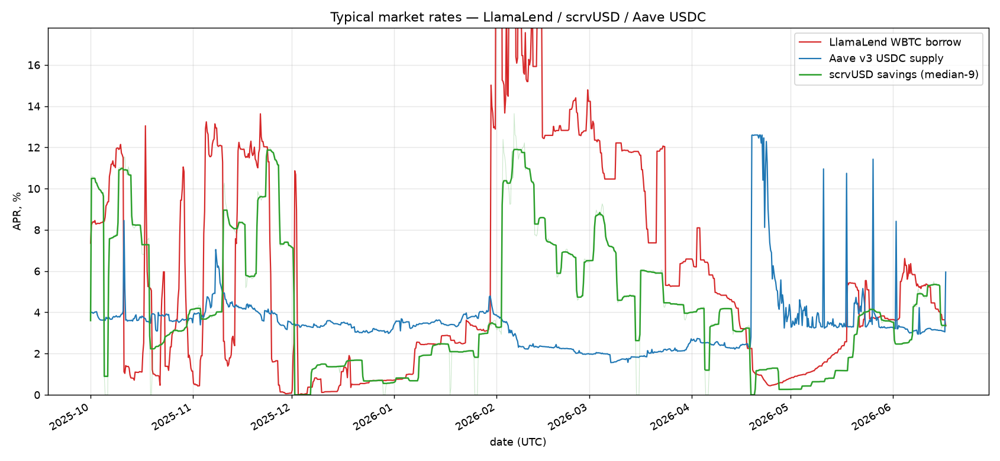
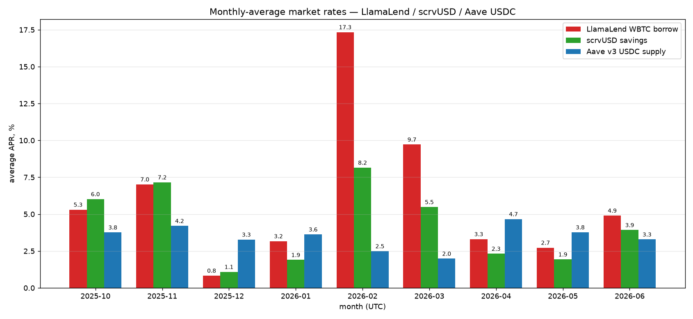

# Typical market rates — LlamaLend / scrvUSD / Aave USDC

Three lending/borrow rates sampled at 1000 time-spaced points over
2025-10-01 … 2026-06-17 (see `fetch_market_rates.py`), one Multicall3 per block.
All rates are reported as **APR** (simple, per-year), in %.

## Sources & how each is read

| Series | Source read | Units → APR |
|--------|-------------|-------------|
| LlamaLend WBTC borrow | `AMM.rate()` @ `0xE0438Eb3…666ea` (per-second, 1e18) | `rate × 365·86400` |
| scrvUSD savings | `scrvUSD.convertToAssets(1e18)` @ `0x0655977F…84367` (price-per-share) | derived: `(pps_i/pps_{i-1} − 1)/dt × yr` |
| Aave v3 USDC supply | `PoolDataProvider.getReserveData(USDC)[5]` @ `0x7B4EB56E…138a3` (ray, 1e27) | `rate / 1e27` (already annual) |

- LlamaLend: the monetary policy `0x07491D…` writes the rate into the AMM;
  `AMM.rate()` is the realized per-second borrow rate (Controller `0x4e595413…`).
- scrvUSD has no instantaneous on-chain rate — it's an ERC4626 vault that unlocks
  profit linearly between harvests, so APR is the local slope of price-per-share.
  This is spiky at harvest steps; the plot smooths it with a rolling median.
- Aave expresses `currentLiquidityRate` in ray as an annual APR already.

## Results (APR over the window)

| Series | Median | IQR (25–75%) | Last (Jun 17) |
|--------|-------:|-------------:|--------------:|
| LlamaLend WBTC borrow | **3.73%** | 1.15 – 10.82% | 3.34% |
| scrvUSD savings       | **3.60%** | 1.39 – 6.29%  | 3.36% |
| Aave v3 USDC supply   | **3.37%** | 2.52 – 3.77%  | 5.95% |



## Interpretation

- **All three cluster around ~3.4–3.7% median**, but with very different
  dispersion. Aave USDC supply is the steadiest (tight IQR ~2.5–3.8%), behaving
  like a utilization-smoothed money-market rate.
- **LlamaLend WBTC borrow is the most volatile** — its IQR spans 1.2%–10.8% and
  it spikes far higher (up to ~140% APR intraday) when utilization runs hot. As a
  soft-liquidation mint market its rate reacts sharply to crvUSD peg / utilization.
- **scrvUSD sits in between**: a savings rate that tracks crvUSD-system revenue,
  noisier than Aave but without LlamaLend's borrow-side spikes.
- Late in the window Aave USDC supply ticks up (last reading ~6%) above the
  Curve-ecosystem rates.

The y-axis in the plot is clipped to a robust max (98th pct ×1.25) so the
LlamaLend utilization spikes don't flatten the rest; pass `--ymax`/`--log` to see
the full range.

## Monthly averages

Samples are evenly spaced in time, so the per-month mean is a fair time-average
APR (spikes included — see the Feb–Mar 2026 LlamaLend values). Generated by
`plot_market_rates_monthly.py`.

| Month | LlamaLend WBTC borrow | scrvUSD savings | Aave v3 USDC supply |
|-------|----------------------:|----------------:|--------------------:|
| 2025-10 | 5.3 | 6.0 | 3.8 |
| 2025-11 | 7.0 | 7.2 | 4.2 |
| 2025-12 | 0.8 | 1.1 | 3.3 |
| 2026-01 | 3.2 | 1.9 | 3.6 |
| 2026-02 | 17.3 | 8.2 | 2.5 |
| 2026-03 | 9.7 | 5.5 | 2.0 |
| 2026-04 | 3.3 | 2.3 | 4.7 |
| 2026-05 | 2.7 | 1.9 | 3.8 |
| 2026-06 | 4.9 | 3.9 | 3.3 |



The cross-over is clear at monthly resolution: the Curve-ecosystem rates
(LlamaLend / scrvUSD) lead in the high-utilization months (Oct, Nov, Feb, Mar)
and spike hard in Feb 2026, while **Aave USDC leads in the quiet months** (Dec,
Apr, May), staying in a tight ~2–4.7% band throughout. The Feb–Mar LlamaLend
means are inflated by intraday utilization spikes; a median view is steadier.

## crvUSD risk premium — scrvUSD vs Aave USDC

Hypothesis: deposits flow into scrvUSD until its yield settles toward a market
rate, and because crvUSD carries extra risk vs USDC, scrvUSD should sit *above*
the USDC lending rate by a risk premium. To test it, scrvUSD price-per-share is
fetched over its full life (since 2024-10-31, `fetch_scrvusd.py`) and its
realized APR is taken over a trailing 14-day pps window (robust to the vault's
weekly harvest steps). Aave v3 USDC supply APR (the long series, `fetch_aave_usdc.py`)
is interpolated by timestamp onto the same samples; spread = scrvUSD − Aave
(`plot_crvusd_premium.py`).

| Window | median spread | mean | IQR | scrvUSD > Aave |
|--------|--------------:|-----:|-----|---------------:|
| Full life (from 2024-11) | +1.62% | +1.67% | [−1.18, +3.20] | 65% |
| Ex-bootstrap (from 2025-01) | **+1.25%** | **+1.06%** | [−1.39, +2.91] | 62% |
| 2025-H2 onward (from 2025-07) | +1.78% | +1.34% | [−1.47, +3.31] | 68% |
| Last 90 days | +0.20% | — | — | — |


**Verdict: ~1% is a fair estimate of the crvUSD risk premium.** Excluding the
Nov–Dec 2024 bootstrap (tiny TVL, erratic APR up to ~37%), the scrvUSD savings
rate sits a median **~1.0–1.3%** above Aave USDC supply, with a mean near +1.1%
and scrvUSD on top ~62% of the time — consistent with depositors demanding a
risk premium to hold crvUSD over USDC.

Two caveats: (1) it is *not constant* — the spread swings with crvUSD borrow
demand and is currently compressed to ~+0.2% (last 90 days), occasionally
negative; (2) mechanistically scrvUSD yield is revenue-constrained
(crvUSD borrow fees ÷ scrvUSD TVL), so the premium is what the system *happens*
to pay, not a hard arbitrage peg to USDC + premium.

## Reproduce

```sh
uv run python fetch_market_rates.py              # -> market_rates.csv.xz
uv run python plot_market_rates.py               # interactive
uv run python plot_market_rates.py --save pics/market_rates.png
uv run python plot_market_rates_monthly.py --save pics/market_rates_monthly.png

# crvUSD risk premium (full scrvUSD life vs long Aave series)
uv run python fetch_scrvusd.py                   # -> scrvusd_pps.csv.xz
uv run python fetch_aave_usdc.py                 # -> aave_usdc_rates.csv.xz
uv run python plot_crvusd_premium.py --save pics/crvusd_premium.png
```
