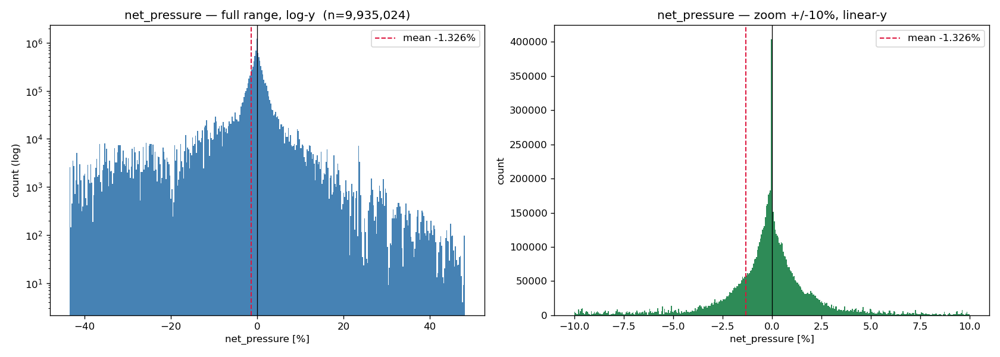
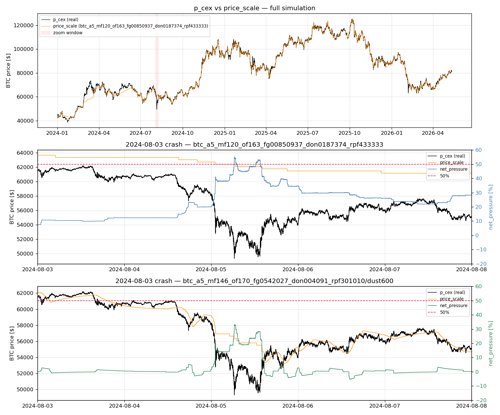

# Net pressure on crvUSD — distribution and stress events

When LevAMM operates it runs a small, temporary imbalance between its **debt**
(denominated in crvUSD) and the crvUSD held in the pool (the supply sink). We
measure that imbalance as **net pressure**:

```
net_pressure = 2 · (levamm_debt − balances[0]) / (balances[0] + balances[1] · price)
```

* `balances[0]` = `token0` = crvUSD side of the pool; `balances[1]` = `token1` = BTC.
* `price` = `p_cex` (the recorded real CEX price).
* LevAMM debt is not stored in the dumps; it is very close to
  `debt ≈ (token0 + token1 · price_scale) / 2`, which we use.
* The factor of 2 normalises against a **half-deposit** (one side of the pool),
  not full TVL — so 50% means the imbalance equals half of one side.

Computed over all `detailed-output.npz.xz` candidate dumps (`net_pressure.py`,
`net_pressure_hist.py`), 2024-01-01 → 2026-05-12, ~10 s resolution.

## Distribution

Pooled over **9.94M** samples across 4 candidates:

| stat | value |
|------|-------|
| mean | **−1.33%** |
| median | −0.13% |
| mean over points with net_pressure > 0 | **+2.21%** |
| fraction of points > 0 | 0.43 |
| p1 / p99 | −33.1% / **+14.0%** |
| min / max | −43.9% / **+55.1%** |



The distribution is **sharply peaked at ~0 with fat tails**. Two features matter
for an incentive design:

1. **Slightly negative-biased and asymmetric** — only ~43% of points are
   positive; debt sits *below* the crvUSD balance more often than above. The
   positive side (a crvUSD *shortfall* in the sink — the side we would spend to
   incentivize) is the rarer tail.
2. **Rare large excursions.** 99% of the time `net_pressure < 14%`, but the tail
   reaches +55%. These are short, violent dislocations — exactly what an
   incentive/PID layer would be built to absorb.

## Where the >50% excursions come from

The extreme positive tail is **not universal** — it clusters in specific
parameter sets and one specific day:

| candidate | min | max | pts > 40% | pts > 50% |
|-----------|-----|-----|-----------|-----------|
| `mf120_of135` | −43.0% | **+54.0%** | 1,545 | 210 |
| `mf120_of163` | −43.9% | **+55.1%** | 1,679 | 243 |
| `mf146 dust3600` | −42.4% | +46.9% | 114 | 0 |
| `mf146 dust600` | −25.8% | +33.2% | 0 | 0 |

Only the two `mf120` candidates exceed 50%, and **~97% of those points fall on
2024-08-05** — the BTC "Black Monday" crash (a few stragglers on 2026-02-06).

## The 2024-08-05 event



Top: `p_cex` and `price_scale` track closely over the full run. Below it, one
zoom panel **per parameter set**: as the real price gaps down, the pool's
`price_scale` **lags**, so `debt = (token0 + token1·price_scale)/2` stays high
relative to the now-cheaper BTC — driving net_pressure up. We contrast the worst
parameter set (`btc_a5_mf120_of163_…`) with one that **barely suffered**
(`btc_a5_mf146_of170_…`, `dust600` variant): both peak at the same instant, but
the imbalance decays ~15× faster for the `mf146_of170` set.

| threshold | `mf120_of163` (cumulative, window UTC) | `mf146_of170` / dust600 (cumulative, window UTC) |
|-----------|----------------------------------------|--------------------------------------------------|
| net_pressure > 20% | **75.0 h** (08-04 17:37 .. 08-07 23:59) | 5.2 h (08-05 06:06 .. 08-05 13:59) |
| net_pressure > 30% | 25.2 h (08-05 01:06 .. 08-06 13:54) | 0.4 h (08-05 06:24 .. 08-05 06:47) |
| net_pressure > 40% | 9.7 h (08-05 01:10 .. 08-05 14:39) | none |
| net_pressure > 50% | 2.0 h (08-05 06:21 .. 08-05 13:36) | none |
| peak | **+55.07%** @ 08-05 06:24:55 | +33.22% @ 08-05 06:24:55 |

The parameter set matters enormously: the `mf146_of170` set sheds the same shock
in hours and never exceeds 40%, while `mf120_of163` carries >20% pressure for
three days. So the rebalancing parameters set the *size and duration* of the
imbalance a slow incentive controller would have to close.

The key takeaway for the incentive design: the spike is **not a momentary blip**.
Pressure stays >20% for ~3 days and >40% for ~10 hours around the crash. That is
slow enough that a controller with a long characteristic time can react and pull
crvUSD into the sink — but the controller must start as soon as pressure begins
to build (proactive), and the incentive must be large (the depositor-response work
suggests ~2× the "norm" APR is needed to move crvUSD), because the imbalance to
close is a meaningful fraction of a half-deposit and persists for hours.

## Scripts

* `net_pressure.py` — per-candidate summary statistics (mean, positive-tail mean).
* `net_pressure_hist.py` — pooled histogram → `pics/net_pressure_hist.png`.
* `plot_net_pressure_event.py` — price tracking + crash zoom + duration table →
  `pics/net_pressure_event.png`.
