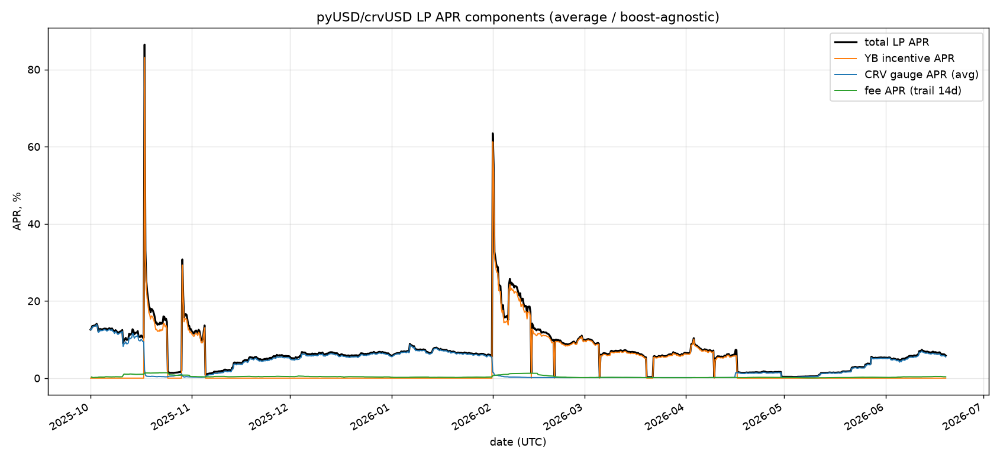
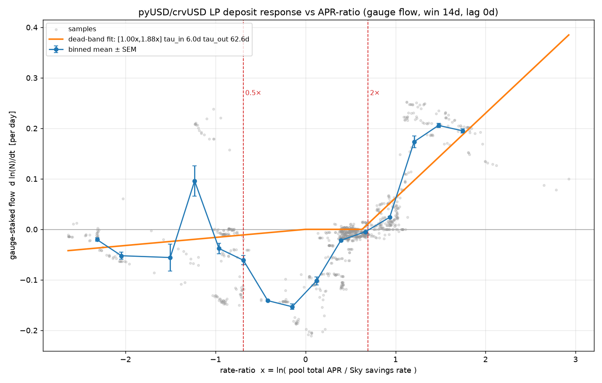
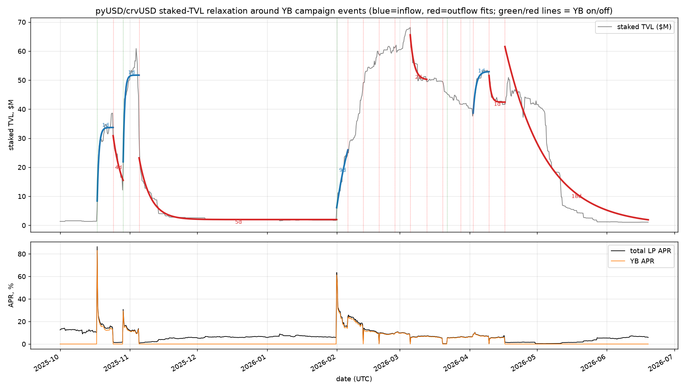

# LP deposit dynamics — pyUSD/crvUSD pool APR & dead-band response

Tests the hypothesis that pool liquidity is a **dead-band negative-feedback loop**:
LPs do nothing while the pool APR is within ~[0.5×, 2×] of a market rate, and
deposit/withdraw — with a ~1/e time constant — only when it leaves that band.
Pool `0x625E…6200` (pyUSD/crvUSD stableswap), market rate = sUSDS Sky savings.

## Measuring the LP APR (the hard part)

The 1bp pool fee makes trading APR small but not negligible (~0.3%); LP returns
are dominated by **YB (Yield Basis) incentive emissions**, plus CRV. We build the
**average / boost-agnostic** APR (total emission value ÷ total staked value, which
is well-defined regardless of per-LP veCRV boost or Curve/Convex/StakeDAO venue):

| Component | Source (per block, `fetch_pool_apr.py`) |
|-----------|------------------------------------------|
| fee APR   | `pool.get_virtual_price()` trailing growth |
| CRV APR   | `CRV_rate × gauge_relative_weight × CRV_price × yr / gauge_TVL`, CRV/USD from Chainlink |
| YB APR    | `YB_rate × YB_price × yr / gauge_TVL`, YB price from the YB/crvUSD pool `price_oracle`, **gated to `timestamp < period_finish`** (Curve gauges keep the last rate after a campaign ends) |

`gauge_TVL = gauge.totalSupply() × virtual_price`. Components over time
(`plot_pool_apr.py`): fee ~0.26% median, CRV ~1.5%, YB 0→83% (active 33% of the
time), total median 6.3% / max 86%.



The Feb-2026 YB campaign (APR → ~80%) lines up exactly with the liquidity ramp
$2M→$68M fit earlier — high APR pulls deposits in, TVL rises, APR steps back down:
the negative-feedback loop, measured.

## The PegKeeper correction — use *staked* TVL

This is a crvUSD **PegKeeper** pool: PK_pyUSD_v2 (`0x3fA20e…`) mints/burns crvUSD
single-sided to defend the peg, changing pool LP supply for reasons unrelated to
yield-seeking. PegKeeper liquidity is **never staked**, so the flow signal must be
**`gauge_staked`** (staked TVL), not pool `totalSupply` — which also puts flow and
APR on the same base. (Empirically this only removed ~5% of the response-function
noise: the PegKeeper is a real but minor confound; lumpy deposits and the
APR↔TVL simultaneity dominate.)

## Response function (instantaneous) — `plot_pool_response.py`

Binning flow `d ln(staked TVL)/dt` against `x = ln(total APR / Sky rate)`:



- **Inflow side: strong confirmation.** Flat dead band, then sharp activation at
  the fitted upper edge **1.88× ≈ 2×**, with **τ_in ≈ 6 d**.
- **Outflow side: asymmetric.** LPs start leaving as soon as APR dips below ~1×
  market (not 0.5×); far below that the flow weakens because the mercenary capital
  has already gone (depletion). Yield-chasing has more friction than yield-fleeing.
- This instantaneous view stays noisy — the wrong tool for a lumpy, self-coupled,
  weekly-driven system.

## Per-campaign relaxation (the conclusive view) — `plot_campaign_response.py`

YB campaigns switch on/off ~weekly. Fitting `TVL(t) = b + a·e^(−t/τ)` to the
staked TVL in each inter-event segment (the exogenous YB step is the driver, so
this sidesteps the simultaneity):



Segments whose τ railed against the fit bound (still-rising, exponential
degenerates to a line) or fit poorly are dropped (`--max-tau`, `--min-r2`),
leaving 9 well-constrained fits:

| | result |
|---|---|
| **Outflow** | **τ ≈ 4–5 d** (median 4.1 d, 5 segments). The Nov 5 → Jan 31 YB-off decay fits τ = 5.0 d at R² 0.96 — reproduces the 5.9 d drop fit independently on the raw liquidity curve. |
| **Inflow** | cleanest single ramp (Jan 31 → Feb 5) τ = **8.5 d**, R² 0.96 — consistent with the 11.4 d rise. The other inflow segments are short, fast top-ups: weekly campaigns re-kick TVL before it relaxes, so the inflow τ is under-determined. |

## Conclusions

- The **dead-band + relaxation model holds**, but the band is **asymmetric**:
  the inflow edge is ≈ **1.9× ≈ 2×** (the 2× guess holds on top — not higher),
  while the outflow edge is ≈ **1×**, not 0.5×. LPs tolerate a high rate lazily
  (don't pile in until ~2×) but won't sit below market at all (leave once APR
  dips under ~1×). So the dead zone is closer to **[1×, 2×]** than the symmetric
  [0.5×, 2×]. Time constants **τ_out ≈ 4–5 d** (well-measured) and
  **τ_in ≈ 8–11 d** (clean episodes) — matching the original PYUSD-pool fits.
- "Noisy as hell" was a tooling problem: the instantaneous response function is
  wrong for this system; **staked TVL around campaign events** turns it into a few
  clean exponentials.
- Structural side-finding: **YB campaigns fire faster (~weekly) than the inflow
  time constant (~8–11 d)**, so liquidity never fully saturates on the way in but
  decays cleanly when incentives stop.

## Reproduce

```sh
uv run python fetch_pool_apr.py                  # -> pool_apr.csv.xz
uv run python plot_pool_apr.py --save pics/pool_apr.png
uv run python plot_pool_response.py --save pics/pool_response.png
uv run python plot_campaign_response.py --save pics/campaign_response.png
# scrvUSD analog (savings-vault version of the same test):
uv run python fetch_scrvusd.py                   # -> scrvusd_pps.csv.xz (+supply)
uv run python plot_scrvusd_response.py --save pics/scrvusd_response.png
```
