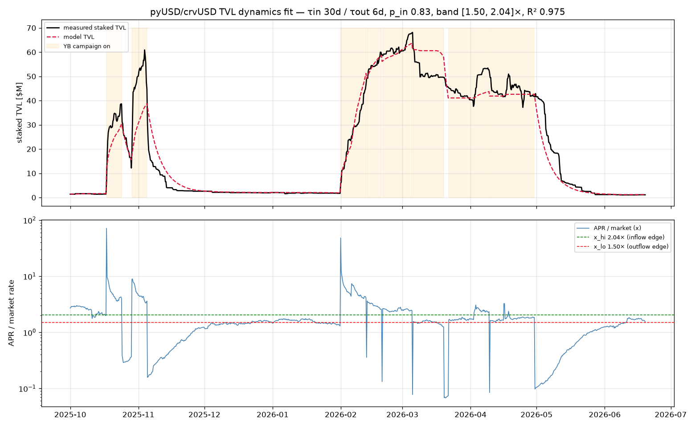
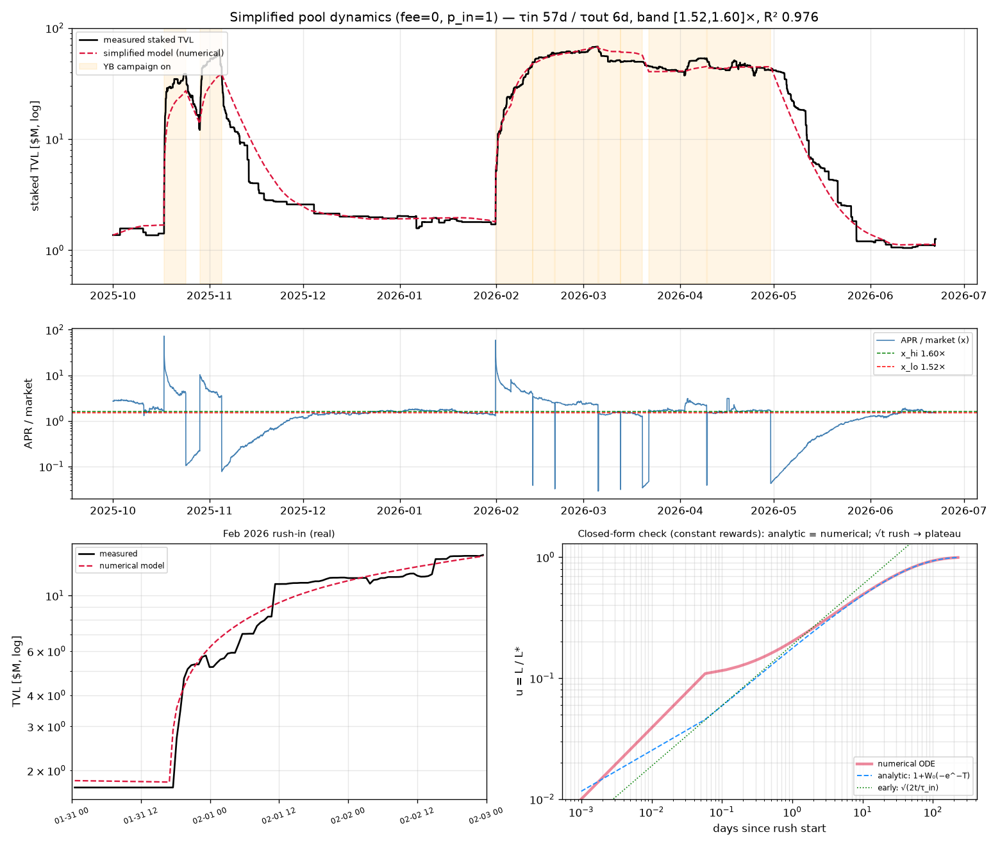

# pyUSD/crvUSD pool — unified TVL dynamics (equilibrium rate + reaction times)

Replaces the per-campaign exponential fits (`REPORT_pool_apr_response.md`,
`REPORT_liquidity_response.md`) with a **single ODE fit against the whole staked-TVL
series**, driven by the measured reward rates. This captures behaviour the
piecewise fits cannot — in particular the **start/stop-on-refill** dynamic: when a
YB campaign ends the APR drops and TVL starts bleeding out, but if the campaign
refills before the outflow completes, the APR jumps back and the outflow simply
halts.

## Model (`fit_pool_dynamics.py`)

The LP APR is **endogenous** — it is `reward_rate / TVL`, so as TVL grows the APR
self-limits. State `L` = staked TVL ($); driver = the real reward series:

```
rewards(t)   = CRV_value(t) + YB_value(t) + YB_LM_value(t) [$/yr]
APR a(t,L)   = fee_apr(t) + rewards / L
x            = a / m(t)            m = sUSDS market rate
dead band [x_lo, x_hi]:
    x > x_hi : inflow   toward L*_in  = rewards/(x_hi·m − fee),  rate (1/τ_in)·(x/x_hi)^p_in
    x < x_lo : outflow  toward L*_out = rewards/(x_lo·m − fee),  rate 1/τ_out
    else     : hold (LPs inert inside the band)
```

**Tiny-pool rush (`p_in`).** A pool starting tiny has a huge APR (`rewards/L`), which
should pull capital in *faster* than a near-full pool — not just by a larger gap to
`L*`, but because the offer is far more attractive. The plain exponential (fixed
`1/τ_in`) can't express that: at the steepest take-offs the model lagged measured TVL
by ~7% (`model/measured ≈ 0.93` when TVL ramps >5%/day). The factor `(x/x_hi)^p_in`
accelerates inflow the further APR sits above the threshold (`p_in=0` recovers the
plain model); with it the lag vanishes (`model/measured ≈ 1.01`).

`CRV_value = crv_rate · gauge_rel_weight · CRV_price · yr` and
`YB_value = yb_rate · YB_price · yr` (gated to `timestamp < period_finish`), both
from `pool_apr.csv.xz`. **Prices are per-block, not constant** — over the window
CRV ranges 4.5× ($0.18–0.79) and YB **9.2×** ($0.08–0.71), so much of the dynamics
is reward *value* moving the equilibrium, independent of the emission rate.

`YB_LM_value` is the **Votemarket Liquidity-Mining YB paid directly to LPs** (via
StakeDAO/Votemarket — bridged pYB to a RewardVault; there were never Merkl
campaigns), which the gauge `reward_data(YB)` does *not* see — exact per-epoch amounts
(`VOTEMARKET_LM_YB`): **331,533 YB** and **331,874 YB**, annualised at the
contemporaneous YB price. The campaign's stated dates are the *voting* windows
(Apr 9–16, Apr 16–23); **LP rewards are distributed one week later**, so the active
reward epochs are **Apr 16–23** and **Apr 23–30 2026**. See the incentive section.

**No boost term.** CRV emissions to the gauge are a fixed total split among stakers
by veCRV-boosted weight — boost only *redistributes* that fixed pot (one staker's
gain is another's loss), so the **average** CRV APR is exactly `CRV_value / TVL`
regardless of boost. A free boost multiplier railed to 1.0 and left the fit
byte-identical, confirming it carries no information here.

## Fit



Optimised against log-TVL (one ODE, whole series):

| quantity | value |
|----------|-------|
| **τ_in** (base inflow) | **30 d** (rail; see note) |
| **τ_out** (outflow) | **5.9 d** |
| **p_in** (tiny-pool rush) | **1.03** |
| **dead band** (equilibrium) | **[1.50×, 2.14×] market** |
| R² (log-TVL) | **0.974** |

(R² progression at the original 1k-point resolution: 0.921 plain → 0.931 with the
tiny-pool rush → 0.956 with the Votemarket LM YB → 0.975 once the LP-reward epochs
are shifted +1 week off the voting window. `pool_apr.csv.xz` is now sampled at
**10,000 points** (~38-min spacing) so the day-scale rush-ins resolve; the fit is
unchanged, R² 0.974.)

The figure's bottom row zooms the two tiny-pool take-offs (Oct-2025, Feb-2026) on a
~3-day, semilogy scale — they show the rush is a burst of **discrete deposit steps**
from ~$1.5M to ~$40M within a day, which the smooth relaxation rides as an envelope.

* **Equilibrium rate:** capital flows until the (endogenous) APR is driven down to
  the top edge (~2.2× sUSDS) and bleeds out until it climbs to the bottom edge
  (~1.5×) — so the equilibrium LP APR sits inside that band, anchored to the market
  rate. (The edges also set the absolute TVL levels via `L* = rewards/(x·m − fee)`,
  so they do double duty.)
* **Reaction times:** τ_out ≈ 8 d (outflow). With the rush term the *base* τ_in
  rails high (≥30 d) — i.e. inflow near equilibrium is slow, and almost all the
  observed filling happens in the **rush regime**, where the effective inflow time
  is `τ_in·(x_hi/x)^p_in` (e.g. ~5 d when APR is 10× the threshold). So "how fast
  LPs arrive" is dominated by *how attractive* the pool is, not a single constant.
* The earlier per-campaign fits (τ_in ~9–11 d) measured an effective inflow during
  high-APR campaigns — consistent with the rush regime here, not the slow base τ_in.

## Analytically solvable simplification (fee = 0, p_in = 1)

Two harmless simplifications make the inflow ODE solvable in closed form: drop the small
trading fee (~0.26% vs the ~2× band) and fix the rush exponent at `p_in = 1` (the fitted
1.03 is degenerate with τ_in and ≈ 1). Then, with `x/x_hi = L*/L` and `u ≡ L/L*`, the
inflow law collapses to a separable autonomous ODE:

```
du/dt = (1/τ_in)·(1 − u)·u^{-1}
```

whose exact solution is `t/τ_in = ln((1−u0)/(1−u)) − (u − u0)`, invertible via the
principal Lambert-W function:

```
L(t) = L*·[ 1 + W₀(−e^{−T}) ] ,   T = t/τ_in + (1−u0) − ln(1−u0)
```

It contains both earlier pictures as limits: **early (`u≪1`) `L ∝ √t`** — the rush — and
**late (`u→1`) `1−u ∝ e^{−t/τ_in}`** — the §3 single exponential. The outflow side
(`p=0`) is a pure exponential. (`fit_pool_dynamics_simple.py`.)



The numerical fit of this simplified model loses nothing — **R² 0.976** (vs 0.974 full) —
confirming fee and the exact `p_in` carry no real information. The bottom-right panel
validates the closed form: integrating the ODE numerically against a constant reward lies
exactly on `1 + W₀(−e^{−T})`, tracking the `√(2t/τ_in)` rush asymptote before the plateau.
(As always the *internal* parameters drift — this fit lands τ_in ≈ 57 d and a narrow band
[1.52, 1.60]× — a different point in the same flat valley; only the curve and the overall
responsiveness are pinned, not the individual edges/τ.)

## Incentive accounting — the April Votemarket campaign (two channels)

The model reads the **Curve gauge** `reward_data(YB)` only, so YB paid through other
venues can be missing. The April 2026 campaign paid LPs through **two** channels,
and the gauge read caught *neither* directly:

**Votemarket v2 campaign 1435** (Arbitrum platform `0x8c2c5A…`), pyUSD gauge, reward
token pYB (bridged YB), **800,000 YB over two weekly epochs**, hook =
`IncentiveGaugeHook`. Of the 800k:

* **~663k YB went directly to LPs** as Liquidity Mining — **331,533 + 331,874 YB** —
  bridged via the hook (pYB) into the StakeDAO/Votemarket **RewardVault** for pyUSD
  LPs (there were never Merkl campaigns). (Exact figures
  from StakeDAO/Votemarket data; they sum to the 663,418 YB the `IncentiveGaugeHook`
  claimed on-chain.) The quoted dates are *voting* windows (Apr 9–16, Apr 16–23);
  LP rewards land **one week later**, so the active epochs are **Apr 16–23** and
  **Apr 23–30**. This is `YB_LM_value`, now added to the model — lifting R² to
  **0.956**, and to **0.975** once the +1-week reward shift is applied, holding up
  the April–May plateau the model previously bled off.
* **~137k YB went to veCRV voters** (vote-buying), which raised the gauge's relative
  weight → more CRV emissions — already in the model via `crv_rel_weight`, which
  spikes **8.6×** for exactly the campaign window:

  | window | crv_rel_weight |
  |--------|----------------|
  | Mar 20 – Apr 16 | 0.257% |
  | **Apr 16 – Apr 30** | **2.225%** |
  | Apr 30 – May 15 | 0.254% |

> **Correction.** An earlier pass read the campaign's per-epoch `leftover` field as
> 0 and concluded "all 800k went to voters." That field is **zeroed once swept to
> the hook**, so it understated the LP share — the hook's claimed total (663k, above)
> is the truth. The cross-chain forensics (`trace_votemarket_lp.py`) had pointed the
> right way (the hook = LP path); the authoritative per-epoch amounts settle it.

## A tiny November 2025 StakeDAO reward

The StakeDAO pyUSD RewardVault (`0x0F67…`) `reward_data(YB)` shows a single 7-day
campaign: **2,527.6 YB + 1.5 CVX**, deposited **2025-11-03** by StakeDAO's
`RewardReceiver` (`0xca3e…`) and streamed to vault depositors through Nov 10. At
~$0.3–0.4/YB that is **~$1k of YB over a week** — a real direct LP reward, but
negligible for the dynamics.

## Tooling

* `fit_pool_dynamics.py` — the unified TVL-dynamics fit (`--x-lo/--x-hi` to fix the
  band; default fits all four parameters).
* `fit_pool_dynamics_simple.py` — the analytically solvable simplification (fee = 0,
  p_in = 1), with the Lambert-W closed-form check.
* `trace_yb_recipients.py` — aggregate YB Transfer recipients over a block window
  (node RPC, `fetch_multi`-batched `getLogs`, tqdm).
* `trace_votemarket_lp.py` — split a Votemarket campaign into voter vs LP shares by
  cross-checking claimers' veCRV votes; it correctly flagged the `IncentiveGaugeHook`
  as the LP path (the on-chain `leftover` field is zeroed once swept and was
  misleading). Final per-epoch LP amounts came from StakeDAO/Votemarket campaign data.

```sh
uv run python fit_pool_dynamics.py --save pics/pool_dynamics_fit.png
uv run python fit_pool_dynamics_simple.py --save pics/pool_dynamics_simple_fit.png
```
